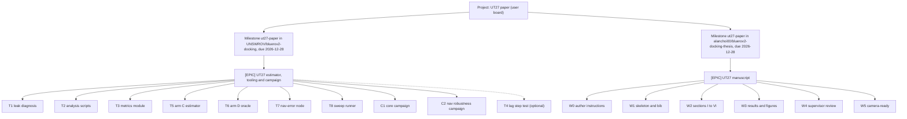
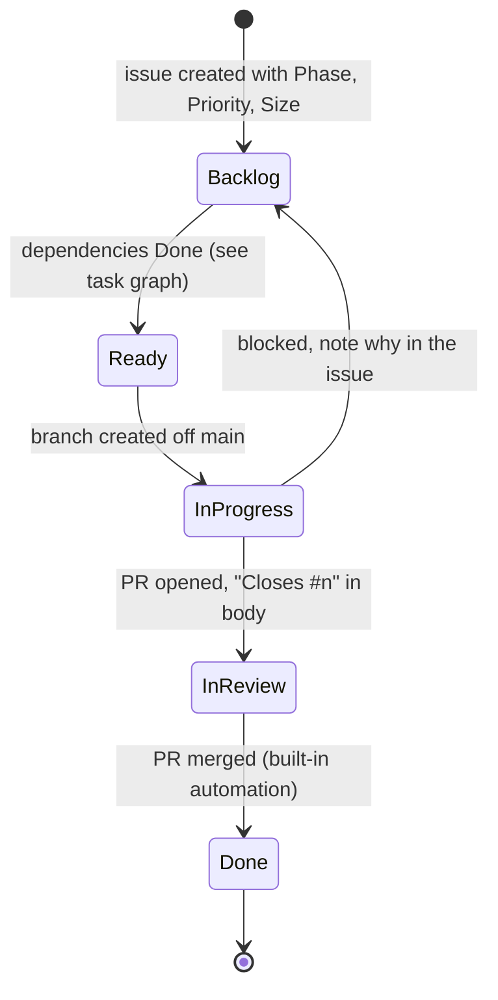
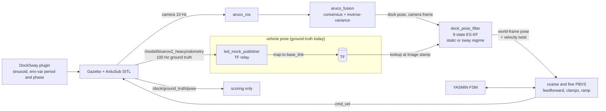
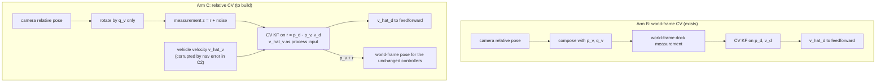
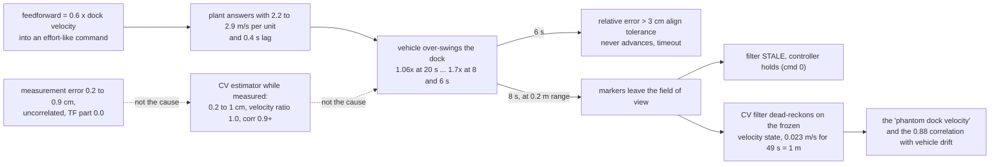
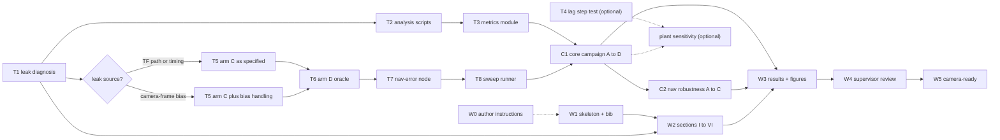
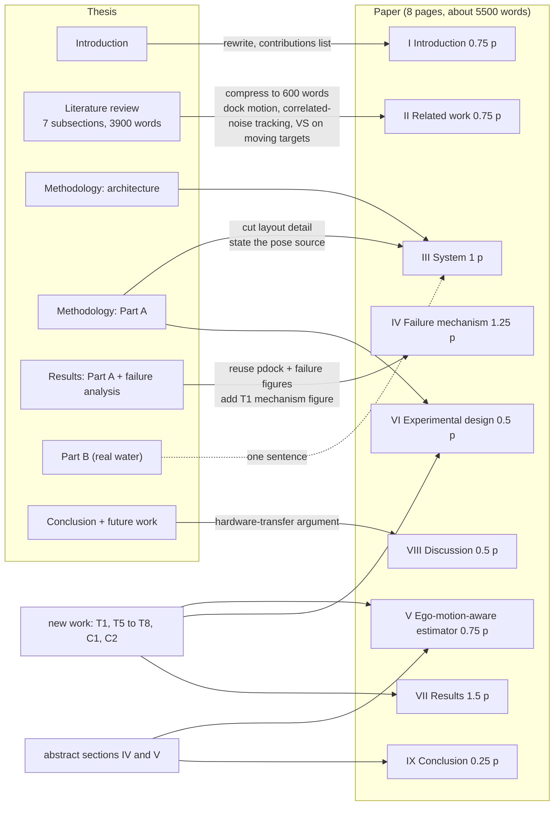
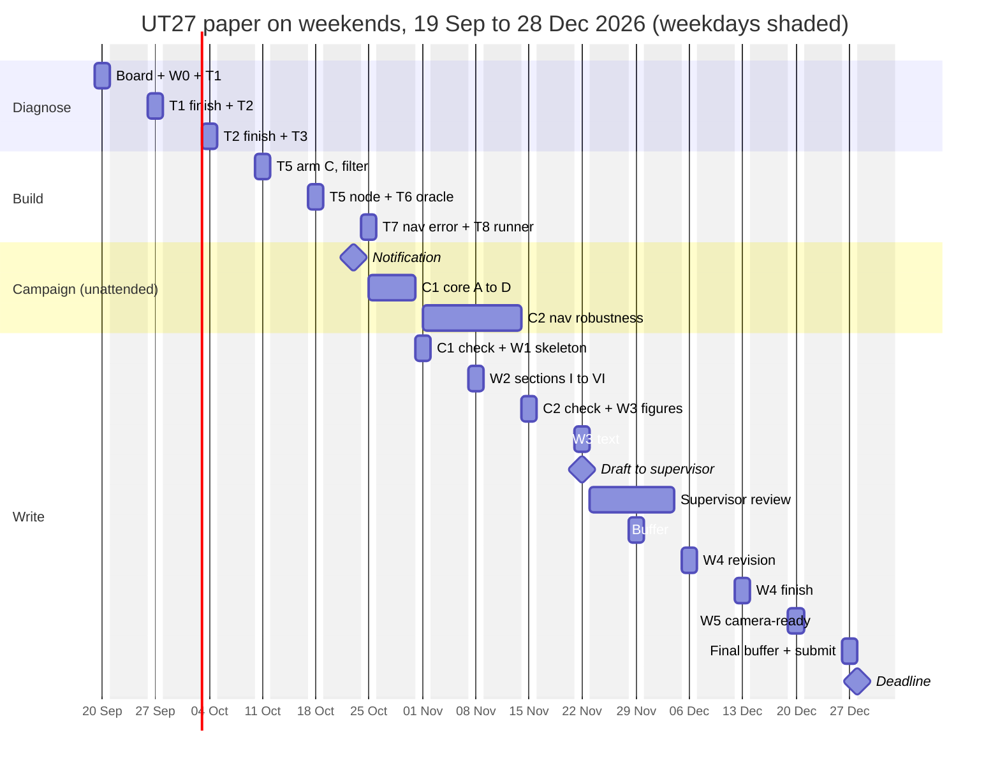

# UT27 full paper: gap analysis and plan

Prepared 2026-09-19 for the UT27 (2027 IEEE Underwater Technology, Tokyo) full paper due 28 Dec 2026.
Sources read: the Thesis C final report (`final/`), the submitted UT27 abstract (`ut27/abstract/`), the `bluerov2-docking`, `blue-sim` and `underwater-aruco-validation` repos, every issue in those repos, the local design docs and memory notes, the trial bags in `~/dev/thesis-bags-backup`, ten reference PDFs in `~/Downloads`, the supervisor's UT27 briefing, the Thesis C presentation, and the GitHub project board.

## 1. Bottom line

1. **The abstract is not a summary of the thesis. It is a promise of new work.** The thesis reports that a constant-velocity (CV) dock estimator with velocity feedforward fails at short sway periods and leaves the fix as future work. The abstract makes the failure the paper's subject and commits to a corrected estimator (C), an oracle feedforward (D), a four-arm comparison under three navigation-error levels, and new metrics. None of (C), (D), the navigation-error injection, or the metric scripts exist in the code today.
2. **Part B of the thesis (real-water ArUco envelope, turbidity, marker sizing) is entirely absent from the abstract.** It should stay out of this paper. It is a separate paper.
3. **T1 is done and it overturns the abstract's mechanism.** On the recorded sweeps the measurement is clean (0.2 to 0.9 cm RMS, uncorrelated with vehicle state) and the CV velocity state is accurate (ratio about 1.0, correlation above 0.9). The failure is control-side: the feedforward over-drives the plant (vehicle amplitude 1.7 times the dock at 8 and 6 s) because the effective plant gain is 2.2 to 2.9 m/s per effort unit against the 1.3 to 1.6 assumed, and the "phantom velocity" is dead-reckoning on a frozen velocity state during the marker blackout that the over-swing causes. Arm C as specified cannot change this. See `t1-leak-diagnosis.md` and the decision block in Section 6.
4. **The thesis's failure-analysis scripts were never committed**, but the bags survive in full (clamped, overnight replication and sigma-a bags, 1.4 GB) and the analysis package rebuilt under T2 (PR #73) regenerates the numbers.
5. Section 2 gives the board setup with commands and an issue manifest, so the work can be tracked from day one.
6. Timeline is tight but workable on weekends only: 15 weekends (30 days) against about 27 days of work, with the two simulation campaigns running unattended on weekdays and one buffer weekend. Section 7.5 has the weekend-by-weekend schedule.

## 2. Set up the project board first

**Created 2026-09-19.** Board: https://github.com/users/alanchoi00/projects/8. Milestone `ut27-paper` in both repos, label `ut27`. Issue numbers: docking repo E1 #62, T1 #63 (closed, done), T2 #64, T3 #65, T4 #66, T5 #67, T6 #68, T7 #69, T8 #70, C1 #71, C2 #72; thesis repo E2 #1, W0 #2, W1 #3, W2 #4, W3 #5, W4 #6, W5 #7. Sub-issues linked under the epics. Status options are the defaults (Todo, In Progress, Done); rename to the five-state set in the UI if wanted. The board's built-in automation closes an issue when its card is set to Done.

The thesis board (`users/alanchoi00/projects/7`) is finished and archival: 48 items, all Done, terms 26T1 and 26T2. I would not reopen it. Create a second user-level board for the paper, reuse the same field vocabulary so the two read alike, and pull issues from both repositories (code in `UNSWROV/bluerov2-docking`, manuscript in `alanchoi00/bluerov2-docking-thesis`).

### 2.1 Structure



Fields, matching the thesis board plus two additions:

| Field | Type | Options |
| --- | --- | --- |
| Status | built-in single select | Backlog, Ready, In progress, In review, Done |
| Phase | single select | Diagnose, Tooling, Estimator, Campaign, Writing |
| Priority | single select | P0, P1, P2 |
| Size | single select | XS, S, M, L, XL |
| Estimate | number | days |
| Due | date | drives the roadmap view |

### 2.2 Workflow on the board



Rules that keep it honest: one branch per issue off the latest `main` (never on a just-merged feature branch), one PR per issue, the PR body says `Closes #n`, and the built-in "item closed" and "pull request merged" automations move cards to Done. Bags and figures are attached to the issue that produced them, not left in a terminal.

### 2.3 Commands

The token currently has `read:project`. Creating and editing needs the write scope:

```bash
gh auth refresh -s project
```

Create the board and the fields (Status already exists; rename its options in the web UI, the CLI cannot edit existing single-select options):

```bash
OWNER=alanchoi00
gh project create --owner $OWNER --title "UT27 paper"
# note the number it prints, then:
N=<number>
gh project field-create $N --owner $OWNER --name Phase    --data-type SINGLE_SELECT --single-select-options "Diagnose,Tooling,Estimator,Campaign,Writing"
gh project field-create $N --owner $OWNER --name Priority --data-type SINGLE_SELECT --single-select-options "P0,P1,P2"
gh project field-create $N --owner $OWNER --name Size     --data-type SINGLE_SELECT --single-select-options "XS,S,M,L,XL"
gh project field-create $N --owner $OWNER --name Estimate --data-type NUMBER
gh project field-create $N --owner $OWNER --name Due      --data-type DATE
```

Milestones and a label in each repository:

```bash
for R in UNSWROV/bluerov2-docking alanchoi00/bluerov2-docking-thesis; do
  gh api -X POST repos/$R/milestones -f title=ut27-paper -f due_on=2026-12-28T12:00:00Z \
    -f description="Full paper for UT27, Tokyo, due 28 Dec 2026"
  gh label create ut27 -R $R --color 1D76DB --description "UT27 paper work" 2>/dev/null || true
done
```

Create the issues from a manifest so titles, labels and milestones stay consistent. Each line: repo, title, phase, priority, size, estimate, due, body file.

```bash
# issues.tsv (tab separated); bodies live in ut27/issues/<id>.md
while IFS=$'\t' read -r REPO TITLE PHASE PRIO SIZE EST DUE BODY; do
  URL=$(gh issue create -R "$REPO" --title "$TITLE" --label ut27 --milestone ut27-paper --body-file "$BODY")
  ITEM=$(gh project item-add $N --owner $OWNER --url "$URL" --format json | jq -r .id)
  echo "$URL $ITEM $PHASE $PRIO $SIZE $EST $DUE" >> created.log
done < issues.tsv
```

Setting fields by CLI needs the project id and each field's id and option id, which come from `gh project field-list $N --owner $OWNER --format json`. A small helper does the lookups once:

```bash
PID=$(gh project view $N --owner $OWNER --format json | jq -r .id)
gh project field-list $N --owner $OWNER --format json > fields.json
fid()  { jq -r --arg n "$1" '.fields[] | select(.name==$n) | .id' fields.json; }
oid()  { jq -r --arg n "$1" --arg o "$2" '.fields[] | select(.name==$n) | .options[] | select(.name==$o) | .id' fields.json; }
set_opt()  { gh project item-edit --project-id $PID --id "$1" --field-id "$(fid "$2")" --single-select-option-id "$(oid "$2" "$3")"; }
set_num()  { gh project item-edit --project-id $PID --id "$1" --field-id "$(fid "$2")" --number "$3"; }
set_date() { gh project item-edit --project-id $PID --id "$1" --field-id "$(fid "$2")" --date "$3"; }
while read -r URL ITEM PHASE PRIO SIZE EST DUE; do
  set_opt "$ITEM" Phase "$PHASE"; set_opt "$ITEM" Priority "$PRIO"; set_opt "$ITEM" Size "$SIZE"
  set_num "$ITEM" Estimate "$EST"; set_date "$ITEM" Due "$DUE"
done < created.log
```

Sub-issue links (epic to task) are set in the web UI or through the GitHub API `sub_issues` endpoint; the CLI has no verb for it yet. Views are UI-only: a Board grouped by Status, a Table grouped by Phase and sorted by Due, and a Roadmap on the Due field with the 23 Oct notification and 28 Dec deadline as markers.

### 2.4 Issue manifest

| Id | Repo | Title | Phase | Pri | Size | Est (d) | Due |
| --- | --- | --- | --- | --- | --- | --- | --- |
| E1 | docking | [EPIC] UT27 estimator, tooling and campaign | Estimator | P0 | XL | | 2026-11-01 |
| E2 | thesis | [EPIC] UT27 manuscript | Writing | P0 | XL | | 2026-12-27 |
| W0 | thesis | Confirm UT27 author instructions (page limit, template, review) | Writing | P0 | XS | 0.5 | 2026-09-20 (done) |
| T1 | docking | Diagnose the ego-motion leak source on the clamped p8 and p6 bags | Diagnose | P0 | S | 2 | 2026-09-27 |
| T2 | docking | Recreate and commit the failure-analysis and trajectory scripts | Tooling | P0 | M | 3 | 2026-10-04 |
| T3 | docking | Per-trial metrics module (success, capture error, closing speed, velocity error, correlations, demotions) | Tooling | P0 | S | 1 | 2026-10-04 |
| T4 | docking | Plant lag and gain step test in each axis (optional) | Tooling | P2 | S | 1 | 2026-11-29 |
| T5 | docking | Ego-motion-aware relative dock estimator, arm C | Estimator | P0 | L | 4 | 2026-10-18 |
| T6 | docking | Oracle dock-velocity feedforward from ground truth, arm D | Estimator | P1 | XS | 1 | 2026-10-18 |
| T7 | docking | Gauss-Markov navigation-error injection node | Estimator | P0 | S | 2 | 2026-10-25 |
| T8 | docking | Sweep runner: arm, navigation level and phase count as inputs | Tooling | P1 | XS | 1 | 2026-10-25 |
| C1 | docking | Core campaign, arms A to D, six periods | Campaign | P0 | M | 1 (+ unattended week) | 2026-11-01 |
| C2 | docking | Navigation-robustness campaign, arms A to C, three levels | Campaign | P1 | M | 1 (+ unattended fortnight) | 2026-11-15 |
| W1 | thesis | Paper skeleton, IEEEtran, bib merged from thesis and abstract | Writing | P0 | S | 1 | 2026-11-01 |
| W2 | thesis | Draft sections I to VI | Writing | P0 | M | 2 | 2026-11-08 |
| W3 | thesis | Results, discussion and final figures | Writing | P0 | L | 4 | 2026-11-22 |
| W4 | thesis | Supervisor review and revision | Writing | P0 | M | 4 | 2026-12-13 |
| W5 | thesis | Camera-ready check and submission | Writing | P0 | S | 2 | 2026-12-20 |

Each issue body should carry three things: the goal in one sentence, the acceptance criterion (a file, a figure, a number), and the dependency ("blocked by T1"). The task definitions in Section 7 are the bodies.

## 3. Conference facts

| Item | Value | Confidence |
| --- | --- | --- |
| Name | 2027 IEEE International Symposium on Underwater Technology (UT27) | verified (aconf, myhuiban listings) |
| Dates | 28 Feb to 3 Mar 2027 | verified |
| Venue | Institute of Industrial Science, University of Tokyo, Komaba | verified |
| Abstract deadline | 18 Sep 2026, extended to 28 Sep 2026 (submitted) | verified (site, pasted by you) |
| Acceptance notification | 23 Oct 2026 | verified |
| Full paper deadline | 28 Dec 2026 | verified |
| Early registration | 31 Jan 2027 | verified |
| Format | IEEE standard double-column (ut27.org links the IEEE conference templates); the abstract's IEEEtran A4 setup carries over | verified |
| Page limit | 4 to 10 pages | verified (Authors page) |
| Publication | IEEE Xplore, proceedings distributed at the symposium | verified |
| Category | Regular Technical Program (abstract accepted for presentation, then full paper); a Student Poster Competition exists for full-time students as lead author, with fee waiver and partial travel support; a JOE special issue is linked from the site | verified |
| Presentation | at least one author registers and presents; one registration covers up to three papers | verified |

The Authors page (pasted 2026-09-19) confirms the table. The December manuscript is "per instructions for publication in the symposium proceedings"; the page does not say whether it is reviewed again, so assume a format check only and write for the reviewers of the abstract. Two things the page adds: the abstract can be re-uploaded with the ID and password until the extended deadline of **Mon 28 Sep 2026**, which is an opportunity to bring the abstract in line with the T1 finding before it is judged; and the Student Poster Competition (fee waiver, partial travel reimbursement) requires a full-time student as lead author, so check whether you still qualify in Feb 2027 and, if so, whether the abstract was entered in that category.

## 4. Thesis versus abstract

### 4.1 What changed in framing

| Aspect | Thesis (Aug 2026) | UT27 abstract (Sep 2026) |
| --- | --- | --- |
| Title | Autonomous visual docking onto a moving dock: terminal guidance in simulation and empirical limits of ArUco perception underwater | Visual dock-velocity feedforward for ROV docking to a moving station: failure mechanism and ego-motion-aware estimation |
| Headline result | Reactive baseline docks cleanly down to 8 s periods; envelope mapped to NSW sea states and dock depths | CV plus feedforward fails at 8 and 6 s through an ego-motion feedback loop; a corrected estimator is proposed and will be evaluated |
| Role of the CV failure | Failure analysis subsection plus future work | The subject of the paper |
| Part B (real imagery, turbidity, marker sizing) | Half the thesis | Absent |
| Sea-state mapping (period to dock depth) | Central to the envelope argument | One sentence in the introduction |
| Capture-mechanism interface (0.15 m funnel, 0.1 m/s) | A design deliverable | Not mentioned |
| Proposed fix | Two options named, untested | One option specified with equations (relative state, vehicle velocity as process input) |
| Evaluation | 2 arms (static filter, CV plus feedforward) by 6 periods by 3 phases, two hosts | 4 arms (A reactive, B naive CV, C corrected, D oracle) by periods with 8 to 12 phases at 6 to 12 s, plus 3 navigation-error levels for A to C |
| Metrics | P(dock), contact-censored scoring, insertion offset and closing speed | Adds capture error, closing speed, and dock-velocity estimation error as first-class metrics |

### 4.2 What the abstract reuses verbatim (safe to carry into the paper)

All numbers in the abstract trace to the thesis and the merged PR #59 results:

- Sweep grid, 38 trials per sweep, replication on two hosts at real-time factors 0.6 and 1.0.
- Baseline clean to 8 s, two of three trials brush the aperture at 6 s at 0.03 to 0.06 m/s.
- Method matches baseline to 12 s, degrades at 10 s, fails at 8 and 6 s.
- Baseline estimated sway amplitude 0.7 to 0.9 of truth; CV 2.4 to 5 times in successes and 18 to 52 times in failures; correlation 0.00 with the true dock and 0.88 of the excess motion with vehicle position.
- Controller-internal alignment 0.000 to 0.017 m versus ground truth 0.17 to 0.48 m in the failures.
- Sigma-a sweep 0.02 to 0.16 m/s^2 gives 5 to 37 times amplitude, no stable setting.
- Identified plant lag about 240 ms and effort gain 1.3 to 1.6, feedforward gain 0.6, feedforward clamp 0.25 m/s, ramp 1.5 m to 0.3 m.
- Figures `clean_pdock.png` and `rov_trajectory_failure.png` are the thesis figures.

### 4.3 Defects in the abstract to fix in the full paper

- Two LaTeX slips render wrongly: `$\hat{v}d$` should be `$\hat{v}_d$`, and `L(s)=K{ff}G_p(s)H_e(s)` should be `K_{ff}`.
- The sentence "a constant-velocity (CV) dock estimator feeding forward a velocity, fails in an instructive way" has a stray comma.
- Equation (1) writes the chain but never defines how `\hat p_v` is obtained. In the simulation it is ground truth (see Section 6). The paper must state this plainly, since it changes what "ego-motion leakage" means.
- The introduction cites Morinaga and Guo in `refs.bib` but only Trslic, Holthuijsen and Short in the text. The full paper has room to use them.
- The abstract says "Nine size-graded ArUco markers on the dock face allow pose estimation from 5 m". The thesis Part B found the 5 m range holds only marginally for the 150 mm class in pool water. In a simulation-only paper, say "in simulation" or drop the range claim.

## 4A. Alignment with the supervisor's briefing

The briefing (`~/Downloads/UT27_briefing_Chak (2).md`) and this plan agree on scope: one result, the A to D comparison, no hardware, no new controller family, Part B reduced to a sentence. Points where the briefing adds to or corrects this plan:

- **Loop interpretation, not a lag claim.** The briefing says do not claim the 240 ms lag alone explains the failure unless the data support it; use the general loop picture `v_hat_d = v_d + H_e(s) v_v + eta`, `L(s) = K_ff G_p(s) H_e(s)`. The thesis text does lean on the lag ("the loop gain crosses unity between the 10 s and 8 s periods"). The paper should present the lag as one factor in `G_p` and let arm D show whether the plant is the limit. T4 (lag re-identification) becomes lower priority; it only matters if the plant-sensitivity experiment is run.
- **Navigation-error model is fully specified.** First-order Gauss-Markov velocity bias `b_v` with correlation time `tau_b`, driving noise scaled to a stationary standard deviation `sigma_b`, accumulated into a position error `b_p`, plus small white terms; three levels by varying `sigma_b` with one `tau_b`; presented as a sensitivity sweep, not a DVL model. Optional small correlated attitude error, since arm C still rotates the measurement by attitude. **No navigation latency** in the first pass. T7 should implement exactly this.
- **Covariance for the vehicle-velocity input.** Arm C should propagate `Q_eff = Q_dock + B R_vv B^T` where `B = [-dt I; 0]`. Add to T5.
- **Third experiment, optional.** Plant-response sensitivity (nominal plus one or two slower first-order command lags) only after the main results exist. Not in the reduced campaign of Section 7.3; add if the core block finishes early.
- **Extra metrics.** Correlation between velocity-estimation error and vehicle motion or navigation error; demotion and loss-of-perception counts. Add to T3.
- **Stop condition.** If arm C does not work quickly, diagnose, report the negative result if informative, and keep the paper around A versus B plus the failure analysis. This makes the Section 6 diagnosis even more important: it tells you early whether C can work at all.
- **Ground truth for scoring only.** All of A, B, C must receive the same corrupted navigation signals. This is the point Section 6 raises: today B receives ground-truth navigation and still fails, which the paper must state, because it means the recorded failure is not caused by the injected navigation error but by something inside the perception chain.

One place the briefing and the recorded evidence disagree: the briefing's mechanism is "observer/navigation error converted into spurious dock velocity". With ground-truth navigation in the recorded sweeps, the paper should widen this to "any temporally correlated error in the world-frame dock measurement", and the T1 diagnosis names the actual source. If it is camera-frame bias, arm C alone will not fix it, and the paper's fix must be argued from the diagnosis rather than from the briefing's assumption.

## 5. What exists in the code today

The state of `bluerov2-docking` on `main` (last feature merge PR #59 on 28 Jul 2026, thesis report PR #60 on 6 Aug):

| Component | State | File |
| --- | --- | --- |
| Dock sway plugin, env-var overridable per launch | done | `src/description/plugins/dock_sway/` |
| Ground-truth dock pose bridge | done | `sim.launch.py`, topic `/dock/ground_truth/pose` |
| 9-state error-state KF, `static` and `sway` regimes, velocity clamp, covariance ceiling, `sigma_a` parameter | done | `src/perception/perception/aruco/lib/kalman.py`, `dock_pose_filter.py` |
| Velocity twist topic | done | `/perception/dock_pose_filtered/velocity` |
| PBVS feedforward with separate clamps and distance ramp; coarse velocity-match handoff gate | done | `src/control/control/pbvs.py`, `coarse_approach_node.py`, `fine_align_node.py` |
| Self-driving trial runner, resumable sweep, P(dock) analyser, contact re-scorer | done | `scripts/` |
| Vehicle pose in sim | Gazebo `OdometryPublisher` at 100 Hz, relayed to TF `map -> base_link` by `led_mock_publisher.py` | ground truth, no noise |
| Filter measurement path | fused camera-frame pose, transformed to `map` with TF looked up at the image stamp (50 ms timeout) | `dock_pose_filter.py` lines 157 to 182 |
| Relative-frame estimator (arm C) | **not started** | |
| Oracle feedforward from ground-truth dock velocity (arm D) | **not started** (the GT pose topic exists; no twist, no controller path) | |
| Navigation-error injection (Gauss-Markov velocity bias) | **not started** | |
| Metrics: capture error, closing speed, velocity estimation error per trial | partial: `rescore_contacts.py` computes insertion offset and speed for the `clamped_*` bags only (hard-coded regex); `replot_vel_check.py` computes amplitude ratio and correlation for one stationary check | |
| Failure-analysis scripts (phantom amplitude, 0.88 correlation, trajectory plots) | **not in git, not on disk**; only the PNGs survive in `final/Figures/` | |
| Blue-sim fork | Jazzy images under UNSWROV, hydrodynamics aligned to von Benzon 2022, added mass still zero (sdformat limitation) | `blue-sim` |

Signal chain as it runs today. The dashed box is what the abstract calls "the vehicle's own estimated pose": in the simulation it is ground truth.



The two estimators the paper compares, and what the new one changes:



Trial evidence on disk: `~/dev/thesis-bags-backup/bags/` holds the headline `clamped_*` sweep (38 bags plus CSV), the `overnight_*` replication sweep (40 bags), the six `sigA*` trade-study bags, six `auto_sway_p18` demonstration runs, and the earlier `damped_sway`, `close_range`, `filter_test` and `dock_trial` bags. The `overnight_*` replication sweep (40 bags from 23 Jul, the pre-bounds filter revision) and the six `sigA*` trade-study bags (two each at 0.02, 0.04 and 0.08) are also in the backup, so PR #59's evidence is complete.

Each recorded bag contains everything needed for offline estimator work: `/perception/dock_pose_measured` (camera frame), `/tf`, `/model/bluerov2_heavy/odometry`, `/dock/ground_truth/pose`, the filter outputs, commands and FSM state. Camera images are not recorded, so the detector cannot be re-run, but the estimator can.

## 6. T1 result: the leak is not in the measurement

Full write-up with tables and figures: `t1-leak-diagnosis.md`. Summary:



Hypotheses H1 to H3 (ego-motion through the transform, camera-frame bias, stamp offset) are rejected by the data; H5 to H7 (feedforward over-drive, blackout dead-reckoning, tolerance starvation at 6 s) are supported. The reactive baseline tracks the dock at an amplitude ratio of about 1 at every period, which is why it docks.

**Decision needed before T5 (talk to the supervisor):**

| Option | What T5 becomes | What the paper claims | Risk |
| --- | --- | --- | --- |
| Story 1, control-first (recommended, now with offline evidence) | Velocity-closed feedforward (preferred over gain calibration, because it also cancels navigation bias), plus a velocity-state decay while STALE (validated offline, Section 7 of the T1 report); arm C kept as the jitter-free velocity source for the navigation-error sweep | Feedforward fails through plant-gain mismatch and lag; the estimator was right; fix verified against the oracle; under navigation error both estimators absorb a slow velocity bias one for one (observability), the relative estimator removes only the jitter (Section 8 of the T1 report) | Departs from the abstract's headline; reviewers accept a corrected mechanism if the evidence is shown |
| Story 2, abstract as promised | Arm C as specified | Relative estimator fixes the failure | Shown offline to equal B with true navigation and to inherit the same velocity bias under navigation error (T1 report, Section 8); the claim cannot be supported |

Task changes under Story 1 (see also T1 report Section 12: the filter's wall-clock timing is fixed on branch `67-filter-sim-time`, so campaigns are comparable across hosts once it is merged): T4 (plant step test per flight mode) becomes mandatory and moves before T5; T5 becomes the feedforward redesign plus the STALE velocity decay (the decay is already validated offline by replaying the real filter on the recorded bags, PR #75, see `t1-leak-diagnosis.md` Section 7); T6 (oracle) is unchanged and now serves as the proof that the estimator is not the limit; T7 and arm C stay, scoped to the navigation-robustness block only.

## 7. Work needed for the full paper

Ordered by dependency. Effort is in weekend days; nothing is scheduled on a weekday except unattended simulation and the supervisor's review.

### 7.0 Dependency graph



### 7.1 Diagnosis and tooling (weekends 1 to 3)

- **T1 Leak diagnosis.** Done 2026-09-19, see Section 6 and `t1-leak-diagnosis.md`. Scripts in `bluerov2-docking/scripts/t1/` (uncommitted).
- **T2 Recreate the lost analysis scripts** under `scripts/` and commit them: per-trial phantom amplitude ratio and correlations, failure trajectory plot, P(dock) curves. Generalise `rescore_contacts.py` (drop the `clamped_` regex) and `analyze_sweep.py` to read arm, period, phase and navigation level from the bag label. 2 to 3 days.
- **T3 Metric definitions** for the paper, implemented once: docking success (clean, contact, none), capture error (lateral and vertical offset at the entry plane), closing speed at the entry plane, dock-velocity estimation error (RMS and amplitude ratio against the ground-truth derivative while the filter is healthy), correlation of that error with vehicle motion and with the injected navigation error, demotion and loss-of-perception counts, and time to dock. 1 day.
- **T4 Plant identification. Done 2026-09-20** (T1 report Section 11): steady gain 2.7 to 2.8 m/s per unit command in both modes, first-order time constant 0.35 to 0.40 s, no pure delay; vertical command inert in ALT_HOLD. Feedforward 0.6 times 2.7 equals the measured 1.6 over-swing. These are the numbers T5 tunes against.

### 7.2 New estimator and experiment arms (weekends 4 to 6)

- **T5 Arm C, ego-motion-aware relative estimator.** State `[r, v_d, delta_theta]` with `r = p_d - p_v` in world-aligned axes, `r_{k+1} = r_k + (v_d - v_v) dt + w`, measurement `z = r + nu` from the camera-relative translation rotated by attitude only. Subscribe to the vehicle odometry twist for `v_v`. Publish the dock pose as `p_v + r` so the controllers, FSM and health gate stay unchanged. Add a `process_noise_regime` value or a separate `estimator` parameter so all arms run from one launch. Propagate the vehicle-velocity uncertainty as `Q_eff = Q_dock + B R_vv B^T`. Unit tests mirroring `test_kalman.py`. 4 to 5 days.
  - If T1 shows the leak is camera-frame bias, extend C with a per-marker bias state or a subset-consistency gate, and say so in the paper.
- **T6 Arm D, oracle feedforward.** Bridge or differentiate `/dock/ground_truth/pose` into a twist on the same topic the controllers already consume, gated by a launch argument. 1 day.
- **T7 Navigation-error injection.** A node between `/model/bluerov2_heavy/odometry` and the TF relay that adds a first-order Gauss-Markov velocity bias (time constant and standard deviation as parameters), integrates it into position, and publishes the corrupted odometry and TF. Arm C must consume the corrupted twist, not the true one, or the comparison is unfair. Use the briefing's model exactly: `b_v` first-order Gauss-Markov with `rho = exp(-dt/tau_b)` and driving noise variance `sigma_b^2 (1 - rho^2)`, `b_p` integrated from `b_v`, small white terms on both, optional small correlated attitude error, no latency. One `tau_b`, three `sigma_b` levels, presented as a sensitivity sweep. 2 days.
- **T8 Sweep runner extension.** Arm, navigation level and phase count as environment variables; label scheme updated; resumable as now. 1 day.

### 7.3 Simulation campaign (weekdays after weekends 6 and 7, unattended)

The abstract promises: A, B, C, D over the same periods with 8 to 12 phases at 6 to 12 s, and A to C at three navigation-error levels. A literal reading is about 450 trials. From the `clamped_*` timestamps a docked trial takes about 90 s wall and a timeout about 4.5 min, so 450 trials is roughly 15 to 22 hours of sim time plus restarts, which is feasible but leaves no room for reruns. Suggested reduced design that still delivers every promised comparison:

| Block | Arms | Periods | Phases | Nav level | Trials |
| --- | --- | --- | --- | --- | --- |
| Core envelope | A, B, C, D | 20, 16 | 3 | nominal (none) | 24 |
| Core envelope | A, B, C, D | 12, 10, 8, 6 | 8 | nominal | 128 |
| Nav robustness | A, B, C | 10, 8 | 8 | low, medium, high | 144 |
| Static sanity | A, B, C, D | static | 1 | nominal | 4 |
| Total | | | | | 300 |

That is about 10 to 14 hours of simulation. Run the core block first so a partial campaign already supports the paper. Launch each block on a Sunday night from the sweep runner (resumable by tag) and check it the following Saturday; a block that dies mid-week is resumed on the weekend, not babysat. Keep two hosts if possible; the thesis's replication claim was a strength.

Note the eGPU freeze history on your workstation (Xid 79). Long unattended sweeps on that machine need the eGPU disconnected or the sweep runner made robust to a host freeze (it is already resumable by tag).

### 7.4 Writing (weekends 7 to 15)

Target 8 pages if the limit is 10, 6 if the limit is 6. Word budget about 5500 words at 8 pages with 7 or 8 figures.

Where each paper section comes from:



| Paper section | Source | Action |
| --- | --- | --- |
| I Introduction (0.75 page) | Thesis intro plus abstract intro | Rewrite. Keep the wave-forcing and NSW sea-state argument to one paragraph. State contributions as a list: mechanism, corrected estimator, oracle-bounded comparison, robustness to navigation error. |
| II Related work (0.75 page) | Thesis `Literature/dock-motion.tex`, `state-estimation.tex`, `docking-overview.tex` | Compress 3900 words to about 600. Three paragraphs: docking with moving stations (Trslic 2020 both papers, Guo 2024 dynamics, Morinaga 2021, Gunzel 2026), target tracking with correlated measurement error and relative-frame estimation (Bar-Shalom), visual servoing on moving targets (Chaumette). Drop acoustic and EM homing, image formation, fiducial marker reviews. |
| III System (1 page) | Thesis `Methodology/architecture.tex` and `part-a-simulation.tex` | Keep the architecture figure and the filter structure figure. Cut marker layout detail to two sentences. State the vehicle-pose source explicitly. |
| IV Failure mechanism (1.25 pages) | Thesis Part A results, failure analysis | Reuse the P(dock) figure and failure trajectory figure, add the T1 mechanism figure. Formalise `v_hat_d = v_d + H_e(s) v_v + eta` and the loop `L(s) = K_ff G_p(s) H_e(s)` with the identified lag from T4. |
| V Ego-motion-aware estimator (0.75 page) | Abstract section IV, expanded | Equations, block diagram comparing B and C signal paths, what is unchanged. |
| VI Experimental design (0.5 page) | Thesis experimental method plus abstract plan | Table of arms, periods, phases, navigation levels, metrics, scoring rules. |
| VII Results (1.5 pages) | New | P(dock) versus period for A to D; capture error and closing speed; velocity estimation error versus period; navigation-error robustness curves for A to C. |
| VIII Discussion (0.5 page) | New plus thesis discussion of lag transfer to hardware | Interpret D against B and C as the abstract promised; hardware transfer argument (production ArduSub in the loop, lag only grows on hardware); limitations (no collision, prescribed sinusoidal motion, single amplitude). |
| IX Conclusion (0.25 page) | Abstract conclusion | Update once results exist. |

Figures to reuse: architecture (tikz), filter structure (tikz), `clean_pdock.png`, `rov_trajectory_failure.png`, possibly `vel_check.png`. Figures to make: mechanism decomposition (T1), estimator comparison diagram, four-arm P(dock), metrics versus period, navigation robustness. Foxglove/Gazebo screenshot only if space allows.

Style points carried over from the thesis: the thesis text has residual typos ("teh", "sematic", "servo-ing", "envelopses", duplicated paragraphs in the fine-alignment subsection). Do not paste thesis paragraphs without a pass.

### 7.5 Timeline (weekends only)

Working time is weekends only: 15 weekends from Sat 19 Sep to Sun 27 Dec, 30 days, against about 27 days of estimated work. The simulation campaigns are the exception: they are launched on a Sunday night and run unattended through the week, so weekday time is used without weekday work. The supervisor's review also happens on weekdays.

| Weekend | Dates | Work | Days |
| --- | --- | --- | --- |
| 1 | 19 to 20 Sep | Board setup (Section 2), W0 author instructions, T1 leak diagnosis started | 2 |
| 2 | 26 to 27 Sep | T1 finished, decision on arm C design; T2 analysis scripts started | 2 |
| 3 | 3 to 4 Oct | T2 finished, T3 metrics module | 2 |
| 4 | 10 to 11 Oct | T5 arm C estimator, first half (filter and unit tests) | 2 |
| 5 | 17 to 18 Oct | T5 second half (node, launch, integration test), T6 arm D oracle | 2 |
| 6 | 24 to 25 Oct | T7 nav-error node, T8 sweep runner; **launch C1 core campaign Sunday night** (notification arrives Fri 23 Oct) | 2 |
| 7 | 31 Oct to 1 Nov | Inspect C1, reruns, W1 paper skeleton and bib; **launch C2 nav-robustness campaign Sunday night** | 2 |
| 8 | 7 to 8 Nov | W2 sections I to VI | 2 |
| 9 | 14 to 15 Nov | Inspect C2, W3 results figures | 2 |
| 10 | 21 to 22 Nov | W3 results and discussion text; **full draft to supervisor Sun 22 Nov** | 2 |
| 11 | 28 to 29 Nov | Buffer: reruns, optional plant-sensitivity block, or slipped tasks | 2 |
| 12 | 5 to 6 Dec | W4 revision from supervisor comments | 2 |
| 13 | 12 to 13 Dec | W4 finished, figures final | 2 |
| 14 | 19 to 20 Dec | W5 camera-ready check | 2 |
| 15 | 26 to 27 Dec | Final buffer; **submit Sun 27 Dec**, one day before the deadline | 2 |

If T5 has not produced a working arm C by the end of weekend 6, apply the briefing's stop condition: launch C1 with arms A, B and D only, keep weekend 7 for C at the 12, 10 and 8 s periods, and drop C2 to one navigation level.



## 8. Literature status

### 8.1 Local PDFs in `~/Downloads`

| File | Paper | Role in the UT27 paper |
| --- | --- | --- |
| `1-s2.0-S0029801819309369-main.pdf` | Trslic et al. 2020, Vision based autonomous docking for work class ROVs, Ocean Eng 196 | Primary prior work: reactive servoing onto a heaving TMS cage |
| `sensors-20-00693-v2.pdf` | Trslic et al. 2020, Neuro-fuzzy dynamic position prediction for autonomous work-class ROV docking, Sensors 20(3):693 | Only prior dock-motion prediction; dock-side sensor, heave only, offline |
| `1-s2.0-S0029801824001392-main.pdf` | Guo et al. 2024, Moored underwater docking system with acoustic guidance, Ocean Eng 294 | Moored docks move; docking sequence |
| `jmse-12-01493.pdf` | Guo et al. 2024, Dynamic characteristic analysis of underwater suspended docking station, JMSE 12(9) | Quantitative dock motion under forcing |
| `2602.16360v2.pdf` | Gunzel et al. 2026, Docking and persistent operations for a resident underwater vehicle (NTNU) | Recent ArUco-based docking with EKF, static dock |
| `shi-et-al-2022-...pdf` | Shi et al. 2023, Integrated AUV docking with offset-free NMPC, Meas. Control 56 | Observer-based docking control, disturbance estimation |
| `An_evaluation_of_artificial_fiducial_markers...pdf` | Cesar et al. 2015 | Part B material; one sentence at most here |
| `Underwater_marker-based_pose-estimation...pdf` | Risholm et al. 2021, ICCVW | Part B material; marker pose uncertainty |
| `The_Effect_of_ArUco_Marker_Size...pdf` | Wang et al. 2023, RCAE | Part B material; likely drop |
| `jmse-13-00102.pdf` | Ni et al. 2025, YOLO-D | Learning-based contrast in related work, one sentence |

Detailed summaries, quotable passages with page numbers, and how each should be cited are in Section 8.3.

### 8.2 Cited in the abstract or thesis but not available locally

- Kinsela et al. 2024 (nearshore NSW wave climate) and Short and Trenaman 1992. Only the numbers are used; the thesis bib entries suffice.
- Bar-Shalom, Li and Kirubarajan 2001, Estimation with Applications to Tracking and Navigation. Needed for the correlated-noise and relative-coordinate arguments; cite chapter and section, not the whole book.
- Holthuijsen 2007, Sola 2017, Garrido-Jurado 2014, Chaumette and Hutchinson 2006, Xu et al. 2021, Kim et al. 2024, Ligorio and Sabatini 2013. All in the thesis bib; no PDFs locally, but they are cited for standard content.

### 8.3 Reference summaries

Page numbers are the printed journal pages, or sheet numbers where unnumbered. Numbers are as printed.

**Trslic et al. 2020, Vision based autonomous docking for work class ROVs, Ocean Eng 196:106840.** Work-class Comanche ROV docking stern-first into a suspended TMS cage in the North Atlantic (Jan 2019). One stern camera, four LED beacons, planar PnP topside, per-DOF PID with feedforward on time-varying setpoints (p.8). No filter; outlier logic holds the last pose (p.9), justified by slow vehicle dynamics. Dock treated as the fixed world frame (p.7). Dynamic case: TMS heave "peak-to-peak amplitude was approximately 1.1 m with a period of 8.5 s" (p.12); "during dynamic docking the contact is inevitable" (p.12). Dock motion was not estimated onboard; depth setpoint was an average of the TMS depth (p.12) and the TMS's own heading and depth sensors were used (p.9). Success box: 0.2 m centre, 5 deg heading (p.11). Pose usable to 4 m accurately, 8 m usable (p.14). Future work: "a TMS motion replication could partially compensate for suspended TMS heave motion" and "Fusing data from the onboard inertial navigation system with vision-based navigation" (p.15). Use: introduction anchor (only published moving-dock ROV docking; 1.1 m at 8.5 s sits inside our failing 8 to 10 s band), reactive-baseline exemplar, and the future-work sentence is exactly the gap the paper fills.

**Trslic, Omerdic, Dooly and Toal 2020, Neuro-fuzzy dynamic position prediction for autonomous work-class ROV docking, Sensors 20(3):693.** Predicts the TMS cage heave (depth) ahead of time with an ANFIS network trained on the cage's own depth sensor (2 Hz), using the January 2019 North Atlantic trial data (cage at about 112 m, 150 s window, p.11). Optimal configuration D = 4 samples spaced 1 s. Performance: two-sigma error 0.10 m at 1 s ahead, 0.23 m at 1.5 s, 0.38 m at 2 s, 0.55 m at 2.5 s, 0.68 m at 3 s (Table 5, p.12). The acceptance criterion is the cage's own tolerance: vertical misalignment within 0.55 m (half the 1.1 m peak-to-peak heave) at least 95 percent of the time, satisfied up to 2.5 s ahead (p.11 to 12). Online retraining is proposed because sea conditions drift (Section 4.3, p.12). Motion is measured on the dock side, heave only, and evaluated offline against recorded data; the prediction is not closed in a docking loop. The introduction notes that moving-dock research "is mainly focused on an AUV docking and on compensation of disturbances in the horizontal plane (e.g., cross-current), while assuming minimal docking station heave oscillations" (p.2), and that TMS heave "can exceed amplitudes of 3 m" (p.2). Use: the thesis's one-sentence characterisation is accurate. Cite it in the introduction as the only prior dock-motion prediction, contrasting three things: dock-side sensor versus onboard camera, heave only versus three axes, offline versus closed loop. Their 2.5 s usable horizon at 8.5 s period is also a useful reference when discussing how far ahead any predictor needs to see relative to the plant lag.

**Guo et al. 2024, Moored underwater docking system for resident UUVs with acoustic guidance, Ocean Eng 294:116802.** Moored funnel dock, 3 x 3 x 4.7 m, 3000 kg, acoustic guidance only at about 0.3 Hz. Lake: 9 of 14 attempts; sea (Dalian, 9 to 10 m, 2 knots current): dock roll 8 deg, pitch 7.5 deg. Capture tolerances 0.8 m cross-track, 10 deg pitch (p.7). Quotable: "a free floating system can provide a steady attitude, but the station may shift or rotate due to the effects of waves on the surface vessel" (p.2); "the effect of surface waves and currents can be reduced as the depth increases" (p.3). Contains an explicit statement that vehicle motion between measurement and use corrupts the relative measurement (p.6), the acoustic analogue of our ego-motion leak. Optical guidance "severely limited by the underwater visibility" (p.3). Use: moored docks are a real class that move; depth-decay argument; their 0.8 m funnel versus Trslic's 0.2 m cage frames why a small-entrance ROV dock needs a better estimator.

**Guo et al. 2024, Dynamic characteristic analysis of underwater suspended docking station, JMSE 12:1493.** CFD plus 6-DOF (DFBI) study of a seabed-moored suspended dock under steady current only ("Water flow is treated as a constant disturbance", p.4). Horizontal excursion up to 1.536 m, vertical 0.33 m (p.11); yaw oscillates between -3.5 and 4.6 deg at 0.25 m/s and does not converge below that (p.12 to 13). "Compared to docking with a fixed dock, the number of contacts increases when docking with a suspended dock" (p.14). Use: the dock is a damped oscillator that swings and yaws; the field answers with structure design and passive contact, not estimation; even the dedicated dynamics study omits wave forcing.

**Gunzel et al. 2026, Docking and persistent operations for a resident underwater vehicle, arXiv:2602.16360v2 (NTNU).** Blueye X3 mini-ROV, 21 ArUco tags (5x5, 22 cm large tags), robot_localization EKF with the tag frame as the global frame (p.5), PID waypoints, 5 deg heading acceptance. 90 percent success at 90 m, about 140 s per docking (p.7). Dock rigid and static. Quotable: "wave-induced forces can be strong enough to dislodge the ROV, even several meters below the waterline" (p.9); deep site chosen for "the absence of wave activity" (p.7). Use: closest system-level sibling (ArUco plus EKF plus small ROV, 2026), archetypal static-dock pipeline the paper extends; direct evidence that shallow docks are wave-driven.

**Shi et al. 2023, Integrated approach to AUV docking based on nonlinear offset-free MPC, Meas. Control 56:733.** Simulation only. Fully actuated AUV, six lights, NMPC with an EKF or MHE observer carrying a constant-input disturbance state (random walk). Dock on the seafloor and fixed as the world frame (p.735 to 736); tolerances 0.2 m lateral, 10 deg. Use: shows the "model the unknown as a random walk" default applied to vehicle disturbance; the paper can position the naive CV dock model as the same convention and show where it breaks when the unknown is the dock and the measurement carries ego-motion error.

**Cesar et al. 2015, An evaluation of artificial fiducial markers in underwater environments, OCEANS Genova.** Tank study, ArUco versus AprilTags versus ARToolKit at six turbidity levels. ArUco needed more than 81 px in deep lighting (sheet 4), angular limit about 70 deg, most turbidity-sensitive of the three, fastest at 27 ms mean. Use: one sentence justifying ArUco and its known limits; Part B material otherwise.

**Risholm et al. 2021, Underwater marker-based pose-estimation with associated uncertainty, ICCVW.** Learned ArUco corner regression with MC-dropout uncertainty. OpenCV ArUco detection rate falls from 100 percent at 8.6 m attenuation length to 51.7 percent at 1.1 m and 0 at 0.4 m (Table 1, p.3710). z-uncertainty dominates because of PnP (p.3709). Note the abstract and Table 1 disagree on error figures; quote with location. Use: justification for a range-dominated, z-heavy measurement noise model.

**Wang et al. 2023, Effect of ArUco marker size, number and distribution, RCAE.** In-air study. Size is the dominant factor; 3 to 5 markers recommended; error scales as pixel noise over marker edge length in pixels (Eq. 3, p.120). Use: cite for the size-graded layout and the 1/n scaling behind the measurement covariance; flag as in-air.

**Ni et al. 2025, Vision-based underwater docking guidance and positioning with YOLO-D, JMSE 13:102.** Vertical docking onto a dock carried by a crewed submersible, treated as static in an NED frame fixed to the dock (p.4 to 5). Cascaded far lights and near AprilTag; last-pose hold (Remark 3, p.7). Pool success about 90 percent; failures attributed to water-flow disturbance (p.24). Use: recent pipeline that still servos on the latest pose and models a vehicle-carried dock as static; disturbance, not detection, is the binding constraint once markers are reliable.

**Cross-paper synthesis.** Every vision-docking pipeline here fixes the world frame to the dock and servos on the latest pose (Trslic p.7, Gunzel p.5, Shi p.735, Ni p.4). None estimates dock velocity onboard from the camera. Dock motion is documented in every deployment class: ship-suspended TMS, moored suspended docks, shallow fixed docks. The only closed-loop moving-dock result (Trslic) coped by averaging depth, using dock-side sensors, and accepting contact. Guo (Ocean Eng, p.6) is the only text that notes measurement timing coupled to vehicle motion, and it is for acoustics.

### 8.4 Citations the full paper still needs (none available locally; all to verify)

Priority for retrieval, since the thesis has nothing on them:

1. Kalman filtering with correlated or state-dependent measurement noise: Bar-Shalom, Li and Kirubarajan 2001 (state augmentation chapter); Simon, Optimal State Estimation, 2006, sections 7.1 to 7.2; Bryson and Henrikson 1968, J. Spacecraft and Rockets 5(6).
2. Relative-frame estimation with own-vehicle velocity as a known input: Kim, Crassidis et al. 2007, J. Guidance Control Dyn. 30(1); Woffinden and Geller 2007, JGCD 30(5); Fehse 2003, Automated Rendezvous and Docking of Spacecraft.
3. Wave-driven platform motion in a KF and landing on oscillating platforms: Triantafyllou, Bodson and Athans 1983, IEEE JOE 8(1) (ship motion as a second-order oscillator, the harmonic alternative to CV); Marconi, Isidori and Serrani 2002, Automatica 38(1); Herisse et al. 2012, IEEE TRO 28(1).
4. Gauss-Markov navigation error models: Brown and Hwang, Introduction to Random Signals and Applied Kalman Filtering; Farrell 2008, Aided Navigation; Groves 2013; Paull et al. 2014, IEEE JOE 39(1) (AUV navigation review).
5. Manoeuvring-target motion models: Li and Jilkov 2003, IEEE TAES 39(4), Part I.
6. Latency and target-motion feedforward in visual servoing: Chaumette and Hutchinson 2007 (Part II), IEEE RAM 14(1); Corke and Good 1996, IEEE TRA 12(5).
7. Already in the thesis bib and reusable: Holthuijsen 2007, Short and Trenaman 1992, Kinsela 2024, Garrido-Jurado 2014, Xu et al. 2021, Kim et al. 2024, Sola 2017, Yazdani et al. 2020 survey, Fletcher et al. 2017 (free-floating REMUS dock).

## 9. GitHub project board and issues

Board "Thesis: Autonomous Underwater Docking" (`users/alanchoi00/projects/7`), read with the refreshed token: 48 items, every one in **Done**. Custom fields are Priority (P0 to P2), Size (XS to XL), Estimate, and Term (26T1 from 16 Feb 2026, 26T2 from 1 May 2026). No notes, drafts or open items, so the board holds nothing beyond the issues themselves.

Reading of the board for the paper:

- The moving-dock spine is #33 (sway plugin, PR #57), #34 (fusion and filter, PR #43), #36 (moving-dock convergence, PR #59), all P1 and Done in 26T1. The paper's new work continues #36.
- Thesis C hardware items (#10 to #17, epics #20 to #22) are marked Done with estimates totalling about 30 units, although no hardware docking, free-floating dock rig, or extended pool campaign was performed (the thesis says so). The paper must not imply hardware trials happened. If a hardware follow-on paper is intended, reopen those under a new term rather than editing history.
- #5 (feed empirical pose-noise statistics into the sim sensor model, P1, Done) was only partly done per the thesis. It is the natural home for T7 (navigation-error injection) and the measurement-noise realism discussion. Reopen or supersede it.
- Part B is #2, #48, #54 with the code in `underwater-aruco-validation` PRs #1 to #5. Out of scope here.
- `UNSWROV/blue-sim`: 11 issues, all infrastructure. Nothing outstanding for the paper except the known zero added mass.

Suggested new issues under a `ut27-paper` term or milestone: T1 leak diagnosis, T2 analysis scripts, T3 metrics, T5 relative estimator, T6 oracle feedforward, T7 navigation-error injection, T8 sweep extension, and the paper itself (mirroring #18 and #23 for the earlier reports).

## 10. Things I could not access or verify, and questions for you

Resolved since the first draft: the important dates, the project board, the Trslic neuro-fuzzy paper, the supervisor briefing, and the presentation file (it is the title, agenda and first nine slides of the Thesis C talk; slides 12 onward are template placeholders, so nothing to reuse).

Still open:

1. `ut27.org` still cannot be fetched from my tools even with the VPN off (the TLS handshake is cut, and the Chrome extension is not connected). Please paste the author instructions: page limit, template, whether the December version is reviewed, oral or poster. The listing for UT25 said 4 to 10 pages.
3. The scripts that produced the failure-analysis statistics and trajectory figures (not in git or on disk).
4. Which host will run the sweeps, and whether the eGPU freeze is resolved.
5. Whether you want the NSW sea-state depth mapping kept. The briefing says drop it unless it helps interpret the selected periods; one sentence tying 8 s to the NSW mean period is enough.

## 11. Immediate next steps

1. Decide whether to re-upload a revised abstract before Mon 28 Sep with the T1 finding (see Section 3).
2. Run the T1 diagnosis on the `clamped_sway_sway_p8` and `p6` bags. This decides the estimator design and the paper's central claim.
3. Review the open PRs in merge order: thesis #8, #9, #10; docking #73, #74, then #75, #76, #78 on #74, #77 on #75, #81 on #77, and #79 and #80 off main.
4. Add `Q_eff` and the briefing's navigation-error model to the T5 and T7 task definitions before starting them.
5. Start T2 while T1 plots are being inspected; both use the same bag readers.
