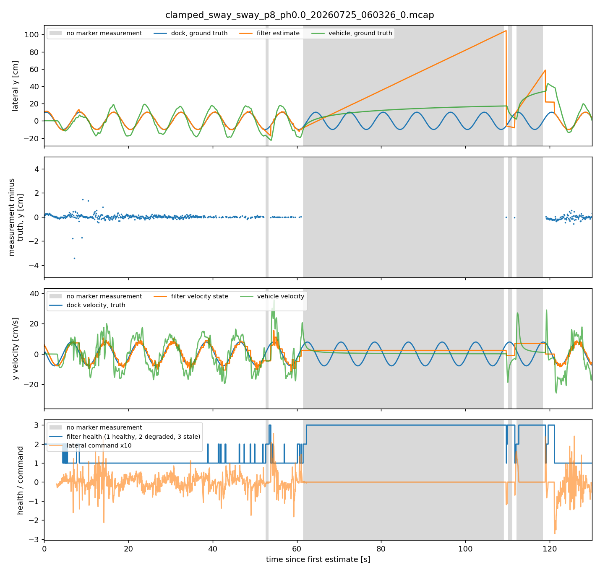

# T1: where does the "phantom dock velocity" come from?

Diagnosis run 2026-09-19 on the recorded `clamped_*` sweep (36 moving-dock trials, 18 per regime, `~/dev/thesis-bags-backup/bags`). Scripts in `bluerov2-docking/scripts/t1/` (`analyze_leak.py`, `windows.py`, `loop_analysis.py`, `sweep_summary.py`, `mechanism_figure.py`; `bagio.py` reads the truncated mcap files without ROS). Raw per-trial table: `t1/sweep_summary.csv`.

## 1. Result in one paragraph

The measurement the filter ingests is clean. Rebuilding the world-frame dock measurement exactly as the node does (TF looked up at the image stamp, applied to the fused camera-frame pose) and subtracting the ground-truth dock position gives 0.2 to 0.9 cm RMS in every trial of both regimes, with no correlation to vehicle position, vehicle velocity, range, or marker count, and a time-shift scan that bottoms out at zero offset. The TF-path part of the error is 0.0 cm. While markers are visible, the constant-velocity filter tracks the dock to 0.2 to 1.0 cm and its velocity state matches the true dock velocity (amplitude ratio 0.99 to 1.17, correlation 0.88 to 0.97) at every period including 8 and 6 s. So there is no ego-motion leakage in the recorded sweeps, and the estimator is not what fails. What fails is the feedforward loop: with the velocity feedforward on, the vehicle over-swings the dock by a factor that grows as the period shortens (1.06 at 20 s, 1.42 at 10 s, 1.69 at 8 s, 1.74 at 6 s), because the lateral command is almost pure feedforward and the plant answers it with about 2.2 to 2.9 m/s per effort unit, not the 1.3 to 1.6 the feedforward gain of 0.6 was calibrated against. At 6 s the over-swing alone keeps the relative error above the 3 cm alignment tolerance and the vehicle never advances. At 8 s the over-swing at 0.2 m range loses the markers; the filter goes STALE, the controller correctly commands zero, and the filter dead-reckons on its frozen velocity state (0.023 m/s) for 49 s to 1 m off. That dead-reckoning excursion is the "phantom dock velocity" in the thesis and abstract. The reactive baseline has no feedforward, so its vehicle-to-dock amplitude ratio stays near 1 at every period, and it docks.

## 2. Evidence

### 2.1 Sweep-wide table (mean over the three phases per cell)

| Period [s] | Regime | Outcome (3 phases) | Meas. error RMS [cm] | Track error while measured [cm] | Velocity state, ratio / corr | Vehicle amp / dock amp | Time without markers | Max estimate error [cm] |
| --- | --- | --- | --- | --- | --- | --- | --- | --- |
| 20 | A reactive (static filter) | 3/3 docked | 0.28 | 2.1 | none (no velocity state) | 0.87 | 3% | 10 |
| 20 | B CV + feedforward | 3/3 docked | 0.25 | 0.3 | 1.09 / 0.92 | 1.06 | 0% | 2 |
| 16 | A reactive (static filter) | 3/3 docked | 0.60 | 3.2 | none (no velocity state) | 0.98 | 16% | 19 |
| 16 | B CV + feedforward | 3/3 docked | 0.24 | 0.4 | 1.10 / 0.93 | 1.20 | 2% | 6 |
| 12 | A reactive (static filter) | 3/3 docked | 0.29 | 4.6 | none (no velocity state) | 1.09 | 7% | 19 |
| 12 | B CV + feedforward | 3/3 docked | 0.24 | 0.4 | 1.05 / 0.95 | 1.20 | 3% | 4 |
| 10 | A reactive (static filter) | 3/3 docked | 0.52 | 4.3 | none (no velocity state) | 0.95 | 12% | 20 |
| 10 | B CV + feedforward | 3/3 docked | 0.20 | 1.5 | 1.05 / 0.95 | 1.42 | 7% | 61 |
| 8 | A reactive (static filter) | 3/3 docked | 0.28 | 5.7 | none (no velocity state) | 1.05 | 12% | 20 |
| 8 | B CV + feedforward | 1/3 docked | 0.43 | 3.5 | 1.03 / 0.94 | 1.69 | 14% | 112 |
| 6 | A reactive (static filter) | 3/3 docked | 0.45 | 7.1 | none (no velocity state) | 0.90 | 16% | 20 |
| 6 | B CV + feedforward | 0/3 docked | 0.39 | 0.9 | 1.01 / 0.92 | 1.74 | 1% | 15 |

Reading across the columns: the measurement error column is the same for both regimes because they share the perception path. Track error and the velocity state show the CV filter is accurate whenever it has measurements. The vehicle amplitude ratio is the column that separates the two regimes and grows with shorter period only in regime B. The maximum estimate error in regime B is large only in the trials with blackout time (p10 phase 2, p8 phases 0 and 2), and small at 6 s where there is no blackout and the trial still times out.

### 2.2 The failed 8 s trial, phase 0 (`t1/p8_ph0_mechanism.png`)

Reading the four panels: the estimate sits on the dock while the vehicle swings wider than both; the measurement error stays inside 1 cm right up to the blackout; the velocity state matches the true dock velocity and the vehicle velocity is twice it; at the blackout the health goes STALE, the command goes to zero, and the estimate ramps at the frozen velocity while the vehicle drifts. When the dock swings back into view the estimate snaps back and the cycle repeats.

Numbers from the gap trace (56 to 120 s): at 60 s the filter is HEALTHY with the estimate at minus 9.3 cm against a true minus 9.2 cm while the vehicle is at minus 17.8 cm. From 64 s the health is STALE for the entire gap, the lateral and surge commands are identically zero, the velocity state holds at plus 0.023 m/s, and the estimate slope is plus 0.0234 m/s. The vehicle moves from 0.01 to 0.17 m over the gap with zero command, so it is not following the estimate. The thesis statistic "excess motion correlates 0.88 with vehicle position" is the correlation of two monotonic drifts, the estimate ramp and the vehicle drift, and carries no causal information.

### 2.3 Tracking windows: the loop, not the estimator

| Window | Vehicle amp / dock amp | Vehicle phase vs dock | Velocity state vs truth | Command amplitude (effort) | Plant gain [m/s per effort] | Vehicle lag behind command |
| --- | --- | --- | --- | --- | --- | --- |
| p8 phase 0, FINE, 20 to 58 s | 1.60 | leads by 13 deg | 8.2 vs 7.7 cm/s, corr 0.92 | 0.054; the feedforward at the fine gain of 1.0 is 0.082, so feedback opposes about a third of it | 2.82 | 0.38 s |
| p8 phase 0, FINE, 185 to 222 s | 1.63 | leads by 22 deg | 8.2 vs 7.8 cm/s, corr 0.97 | 0.047, feedforward 0.082 at gain 1.0 | 2.90 | 0.39 s |
| p8 phase 0, COARSE, 8 to 19 s | 1.33 | leads by 15 deg | 7.9 vs 7.7 cm/s, corr 0.95 | 0.065, feedforward 0.047 | 2.20 | about 1 s (short window, low confidence) |
| calibration trial `damped_sway_150515`, 5 s dock period | 1.83 | lags by 18 deg | 10.8 vs 12.6 cm/s, corr 0.90 | 0.106, feedforward 0.065 | 2.31 | 0.48 s |
| p8 phase 2, baseline (no feedforward), 3 to 22 s | 0.89 | lags by 5 deg | no velocity state | | | |

The lateral command in regime B is dominated by the feedforward term. Corrected 2026-09-20 (Section 13): the 0.6 gain is coarse only; the fine controller, where both failures occur, passes the feedforward at gain 1.0. With a plant gain of 2.2 to 2.9 that is 2.2 to 2.9 times the dock velocity from the feedforward alone, and the position feedback (kp 0.8 on an error that the plant lag delays by 0.4 s) pulls it back only to the measured 1.6 to 1.7. The vehicle leading the dock is the signature of over-driven feedforward, not of estimator lag. The calibration trial that produced the 1.3 to 1.6 gain figure shows a gain of 2.3 when re-analysed the same way; the earlier figure was probably read from a different signal or window. The plant lag re-measured here is 0.38 to 0.48 s, not 0.24 s.

### 2.4 What the baseline does

The constant-position filter lags a moving dock (track error 2 to 7 cm, growing as the period shortens), yet the vehicle follows the dock at an amplitude ratio of about 0.9 to 1.05 with a lag of a few degrees. Position feedback on a lagging estimate is enough at these periods; the vehicle's own bandwidth is not the limit down to 6 s. This is why the baseline docks everywhere.

## 3. Hypotheses tested

| Hypothesis | Prediction | Observed | Verdict |
| --- | --- | --- | --- |
| H1 ego-motion leaks through the measurement transform (thesis, abstract) | world-frame measurement error correlated with vehicle state, TF-path error non-zero | 0.2 to 0.9 cm RMS, correlations within plus or minus 0.07, TF part 0.0 cm | rejected |
| H2 camera-frame bias from marker subset switching or PnP | camera-frame error depends on marker set or range | subset means within 0.1 cm, no range dependence | rejected |
| H3 stamp offset between camera and odometry | error minimised at a non-zero time shift | minimum at zero shift; 0.1 s shift doubles the error | rejected |
| H4 the CV velocity state is wrong while tracking | velocity ratio far from 1 or low correlation | ratio 0.99 to 1.17, correlation 0.88 to 0.97 | rejected |
| H5 feedforward over-drives the plant (gain mismatch plus lag) | vehicle amplitude ratio above 1 only in regime B, rising with shorter period; command dominated by feedforward | 1.06 to 1.74 in B, 0.87 to 1.09 in A; feedforward is 90 to 100 percent of the command | supported |
| H6 marker loss from over-swing triggers dead-reckoning on the frozen velocity | blackout follows a wide swing at short range; estimate ramps at the velocity state; controller holds | exactly as predicted in p8 phases 0 and 2, p10 phase 2 | supported |
| H7 at 6 s the failure is over-swing without blackout | no gaps, accurate tracking, relative error above the align tolerance | 1 percent blackout, 0.9 cm tracking, ratio 1.74, 0 of 3 docked | supported |

## 4. Consequences for the paper

1. **The abstract's mechanism is not what happened in simulation.** With ground-truth navigation there is no correlated measurement error, and the estimator's velocity is right. The paper cannot claim ego-motion leakage from these sweeps. It can say that the feedforward failed, and now say why.
2. **Arm C as specified cannot change the outcome.** It removes a term that is already zero. If arm C is built and swept on the current simulation it will match arm B, which would be an uninformative negative result.
3. **The estimator-side hazard that is real is dead-reckoning during blackout.** A CV filter that keeps integrating a frozen velocity while STALE produces the metre-scale excursions and the misleading health-independent signals the thesis reported. This is a one-line fix (decay or zero the velocity state after N seconds without an update) and a legitimate paper point, but it is secondary because the controller already ignores the estimate when STALE.
4. **The control-side cause is a mis-scaled open-loop feedforward into an effort-like command with 0.4 s of lag.** Options for the paper's "fix" arm, in order of cost: (a) calibrate the feedforward gain to the identified per-mode plant gain and re-sweep, (b) put the feedforward through a velocity loop (command the vehicle velocity, close it on odometry velocity) so the plant gain no longer matters, (c) a lag-compensated feedforward. Arm D (oracle dock velocity) is still worth running: with a correct velocity and the same gain error it should over-swing the same way, which proves the point independently of the estimator.
5. **The navigation-error experiment becomes the place where the abstract's mechanism can appear.** With injected Gauss-Markov navigation error, the world-frame estimator (B) will inherit it and the relative estimator (C) will not. That comparison is honest and still fits the abstract's plan, but it needs to be framed as "under realistic navigation", not as the explanation of the recorded failure.

## 5. Decision needed

The paper's story has to change from "estimator coupling, fixed by a relative-frame estimator" to one of:

- **Story 1, control-first (recommended):** velocity feedforward for a moving dock fails through plant-gain mismatch and lag, not estimation; the estimator was right; the fix is a calibrated or velocity-closed feedforward, verified against the oracle; the relative estimator matters only once navigation error is present, shown in the robustness sweep.
- **Story 2, abstract as promised:** build arm C anyway and rely on the navigation-error sweep to show its benefit. Risk: in the nominal sweep C equals B, and the reviewers will ask why B fails when its estimate is accurate.

Either way the supervisor's stop condition applies: report the negative result, which is informative. This needs a conversation with the supervisor before T5 starts, because it changes what T5 is.

## 6. Loose ends

- The 1.3 to 1.6 plant gain and 240 ms lag quoted in the thesis do not reproduce from the calibration bag with this method (2.3 and 0.48 s). T4 (a clean step test per mode) is no longer optional.
- The p6 static-regime phase 3 bag has 716 measurements against about 200 for its siblings; check whether that trial ran longer or double-recorded.
- The thesis's amplitude statistics (2.4 to 5 times in successes, 18 to 52 times in failures) are whole-run standard-deviation ratios dominated by blackout segments. The per-window numbers above should replace them.

## 7. Follow-up, 2026-09-20: offline replay and the estimator half of the fix

The real filter class was replayed offline on the recorded measurement streams with the node's parameters and timing (`python3 -m analysis replay`, PR UNSWROV/bluerov2-docking#75). It reproduces the recorded estimate to 0.3 to 0.8 cm RMS while the filter is live and reproduces the blackout runaways, so the replay is a valid stand-in for the node.

| Trial | Replay minus recorded, live RMS | Max excursion from truth: recorded | replay | replay with velocity decay (1 s hold, 1 s time constant) |
| --- | --- | --- | --- | --- |
| p8 phase 0 | 0.4 cm | 112 cm | 114 cm | 33 cm |
| p8 phase 2.094 | 0.8 cm | 53 cm | 52 cm | 29 cm |
| p10 phase 2.094 | 0.5 cm | 61 cm | 57 cm | 20 cm |
| p12 phase 0, no blackout | 0.3 cm | 3 cm | 3 cm | 3 cm |

Decaying the velocity state once no update has been accepted for one second removes the runaway (`t1/replay_p8.png`). The residual 20 to 33 cm is the dock continuing to sway while the estimate is frozen, which is the floor for any estimator without measurements. This is the estimator half of the fix arm, validated before any simulation run; the production filter is unchanged pending the T5 decision.

**Plant gain, method caveat.** The 2.2 to 2.9 m/s per effort unit quoted above is the broadband ratio of vehicle-velocity to command standard deviation in the tracking windows. A sinusoid fit at the dock frequency, which isolates the response to the feedforward component, gives about 4.8 on the same windows, because the feedback path adds command content at other frequencies. Both are closed-loop estimates and both say the gain is well above the 1.3 to 1.6 the feedforward was tuned to; neither is the number for the paper. T4 step tests are.

The per-trial metrics module (PR #74) and the preliminary plant identification over all tracking windows (branch `66-plant-id-prelim`) are the tooling for the campaign; their outputs over the existing sweep are in `t1/clamped_metrics.csv` and `t1/plantid.csv`.

## 8. Follow-up, 2026-09-20: arm C offline, and navigation error

The relative-frame estimator from the abstract (state `[r, v_d]`, `r = p_d - p_v`, vehicle velocity as process input; `scripts/analysis/relative_kf.py`) was replayed next to the production world-frame filter on four clean-tracking trials (20, 12, 10 and 8 s), first with the recorded ground-truth navigation and then with the briefing's Gauss-Markov navigation error injected at three levels (velocity-bias sigma 0.01, 0.03 and 0.10 m/s, correlation time 30 s, white position and velocity noise 5 mm and 5 mm/s), three seeds each. The vehicle motion is the recorded one, so this is the estimator half of the navigation-robustness experiment (`scripts/analysis/navreplay.py`, PR UNSWROV/bluerov2-docking#77; data `t1/navreplay.csv`, figure `t1/navreplay_p8_high.png`).

| Level | Arm | Velocity error RMS [cm/s] | slow part | fast part | Injected bias RMS | Amplitude ratio | Slow error vs bias, corr | Relative position error [cm] |
| --- | --- | --- | --- | --- | --- | --- | --- | --- |
| none | B | 1.26 | 0.78 | 0.86 | 0 | 1.01 | | 2.9 |
| none | C | 1.59 | 0.76 | 1.33 | 0 | 1.05 | | 3.7 |
| low | B | 4.68 | 1.70 | 4.27 | 0.76 | 1.61 | 0.31 | 3.7 |
| low | C | 1.81 | 1.12 | 1.35 | 0.76 | 1.06 | 0.59 | 3.5 |
| medium | B | 5.15 | 2.73 | 4.24 | 2.29 | 1.66 | 0.64 | 3.7 |
| medium | C | 2.85 | 2.40 | 1.37 | 2.29 | 1.15 | 0.84 | 3.5 |
| high | B | 8.07 | 6.72 | 4.03 | 7.65 | 2.01 | 0.87 | 3.6 |
| high | C | 7.39 | 7.03 | 1.62 | 7.65 | 1.76 | 0.92 | 3.5 |

Three findings:

1. **With ground-truth navigation, arm C reproduces arm B.** Velocity error 1.6 against 1.3 cm/s, amplitude ratio 1.05 against 1.01. This closes the question in Section 4, item 2, with data: building arm C would not have changed the nominal sweep.
2. **Both estimators absorb a slow vehicle-velocity bias one for one.** The slow part of the velocity error equals the injected bias at every level and correlates with it at 0.6 to 0.9 for both arms. A camera that measures relative position cannot tell a slowly varying vehicle-velocity error from dock velocity. This is an observability limit, not a filter design flaw, and it holds for arm C as much as for arm B.
3. **What arm C removes is the fast part.** The world-frame filter differentiates the white position noise in the navigation solution into about 4 cm/s of velocity jitter and an amplitude ratio of 1.6 already at the low level; the relative estimator stays at 1.4 cm/s and a ratio near 1. The relative-position estimate that the controller servos on is the same for both, about 3.5 cm, at every level.

Consequence for the fix arm: a relative estimator does not make velocity feedforward immune to navigation bias. Closing the feedforward through a velocity loop on the same odometry does, because the bias cancels between the estimated dock velocity and the loop's own velocity measurement. Combined with Section 7, the estimator half of the fix is the stale velocity decay, and the control half is the velocity-closed (or plant-calibrated) feedforward; arm C earns its place only as the jitter-free velocity source under realistic navigation, which is a smaller claim than the abstract made.

## 9. Follow-up, 2026-09-20: plant gain and lag from all tracking windows

`python3 -m analysis plantid` fitted the lateral vehicle-velocity response to the lateral command at the dock frequency in every measured stretch of a mission phase at least two periods long, over the clamped and overnight sweeps (31 windows, `t1/plantid.csv`, PR UNSWROV/bluerov2-docking#76). Feedforward-arm windows only; the baseline carries no feedforward and its command is too small to fit.

| Mode | Windows | Gain at the dock frequency, median (IQR) | Broadband gain, median | Lag, median (IQR) |
| --- | --- | --- | --- | --- |
| COARSE (ALT_HOLD) | 5 | 3.87 (3.42 to 4.31) | 2.22 | 0.47 s (0.36 to 0.67) |
| FINE (STABILIZE) | 18 | 5.49 (4.95 to 6.54) | 2.95 | 0.58 s (0.47 to 0.80) |

By period in FINE: gain 7.15 at 10 s, 4.98 at 8 s, 5.49 at 6 s; lag 0.50 to 0.61 s; vehicle-to-dock amplitude ratio 1.48, 1.71 and 1.78. Regenerated 2026-09-20 after the review found the fit frequency came from an FFT with window-dependent resolution; it now comes from the trial label. Medians moved by less than 0.2 and the lags by about 0.1 s; the superseded table is `t1/plantid_fft_period_superseded.csv`.

Units are m/s of vehicle velocity per unit of `cmd_vel`. Both estimators put the gain at two to four times the 1.3 to 1.6 the feedforward was calibrated to, and the lag at about twice the 240 ms the thesis quotes. The over-swing replicates on the overnight sweep (vehicle-to-dock amplitude ratio 1.4 to 2.0 in FINE at 8 and 6 s). These are closed-loop fits and remain priors; T4's step tests give the number for the paper.

## 10. Follow-up, 2026-09-20: replication sweep and sigma-a bags

**Replication (`t1/sweep_summary_all.csv`).** The `overnight_*` sweep (second host, real-time factor 0.6, earlier filter revision with the velocity state unbounded) shows the same mechanism: measurement error 0.2 to 1.2 cm RMS, velocity state accurate while measured (ratio 0.80 to 1.01, correlation 0.89 to 0.93), and the vehicle-to-dock amplitude ratio rising only in the feedforward arm, 0.97 at 20 s, 1.14 at 10 s, 1.41 at 8 s, 1.55 at 6 s, against 0.85 to 0.98 for the baseline. Outcomes: baseline 18 of 18 docked; feedforward 2 of 3 at 8 s and 1 of 3 at 6 s. The unbounded velocity state produced a 60 cm excursion at 8 s, smaller than the clamped revision's 112 cm because the trial spent less time in blackout, not because the mechanism differs.

**Sigma-a trade study (`t1/sigA_check.csv`).** Six bags at acceleration-noise densities 0.02, 0.04 and 0.08 m/s^2, at 8 and 6 s:

| sigma_a | Period | Docked | Meas. error | Track error | Velocity ratio / corr | Vehicle over dock | Blackout | Max estimate error |
| --- | --- | --- | --- | --- | --- | --- | --- | --- |
| 0.02 | 6 | no | 0.23 cm | 3.5 cm | 0.93 / 0.73 | 1.93 | 0 | 25 cm |
| 0.04 | 6 | no | 0.24 cm | 1.4 cm | 0.99 / 0.88 | 1.91 | 2% | 17 cm |
| 0.08 | 6 | no | 1.10 cm | 0.9 cm | 1.00 / 0.92 | 1.82 | 1% | 3 cm |
| 0.02 | 8 | no | 0.19 cm | 1.4 cm | 0.97 / 0.88 | 1.65 | 1% | 6 cm |
| 0.04 | 8 | yes | 0.21 cm | 0.9 cm | 0.98 / 0.93 | 1.56 | 0 | 4 cm |
| 0.08 | 8 | no | 0.20 cm | 0.4 cm | 1.01 / 0.96 | 1.63 | 0 | 2 cm |

The velocity state is accurate at every density and the over-swing is 1.6 to 1.9 regardless, which is why the thesis's tuning sweep could not move the cliff: the knob it turned was not connected to the failure. The thesis's "5 to 37 times" amplitude figures for these bags are whole-run statistics inflated by the short blackouts, as in Section 2.2.

## 11. T4 step tests, 2026-09-20: the open-loop plant

Recorded in the simulator with the dock static and no docking controller (`scripts/plantid/record_step_tests.sh`, PR UNSWROV/bluerov2-docking#78): a rest, a plus and a minus step of 0.1 command units held 8 s each, then three cycles of 0.1-amplitude sinusoid at 8 s and 6 s, per axis and flight mode. Fitted with `python3 -m analysis stepfit` (first-order plant with pure delay, output-error fit). Bags in `~/dev/thesis-bags-backup/bags/plantid_*`.

| Mode | Axis | Gain [m/s per unit command] | Pure delay | Time constant | Fit residual |
| --- | --- | --- | --- | --- | --- |
| ALT_HOLD | lateral y | 2.78 | 0.00 s | 0.40 s | 3.1 cm/s |
| ALT_HOLD | vertical z | 0.01 | | | 0.7 cm/s |
| STABILIZE | lateral y | 2.76 | 0.02 s | 0.35 s | 3.1 cm/s |
| STABILIZE | vertical z | 2.62 | 0.00 s | 0.25 s | 1.9 cm/s |

Reading: the command channel is a first-order lag with a steady gain of about 2.7 m/s per unit and a time constant of 0.35 to 0.40 s, with no measurable pure delay. In ALT_HOLD the vertical command does nothing, as it should, because the autopilot holds depth. The closed-loop fits of Section 9 were biased by the feedback path: their broadband ratio (2.2 to 3.0) was close to the truth and their sinusoid-fit gain (3.9 to 5.5) was not; their "lag" of 0.5 to 0.6 s is the phase lag of the 0.4 s time constant plus feedback, not a transport delay.

Consequence (corrected 2026-09-20, Section 13): in the coarse phase the feedforward gain of 0.6 times a plant gain of 2.7 puts 1.6 times the dock velocity into the vehicle from the feedforward alone; in the fine phase, where both failures occur, the gain is 1.0 and the feedforward alone drives 2.7 times the dock velocity, which the position feedback pulls back to the measured 1.6 to 1.7 over-swing at 8 and 6 s. The gain the feedforward should have been designed against is 2.7, not 1.3 to 1.6, and the effective lag is a 0.4 s first-order response, not 240 ms. The extra 10-minute first recording (`..._083135_stuck`) is the same ALT_HOLD lateral test followed by idle time; its fit is not meaningful and it is kept only as a duplicate of the command sequence.

## 12. Simulator runs, 2026-09-20: what is valid and what is not

**Valid: the T4 step tests** (Section 11). They ran first, with no controllers, a static dock and a single perception stack, and the fit uses sim time on both signals, so the real-time factor does not enter.

**Not valid: the arm D trial and both injector trials.** After the T4 session I stopped the simulator by force, which left one copy of the perception stack running (Gazebo localiser, TF relay, marker relay, fusion, filter, visualiser). Every docking trial that followed ran with two relays publishing `map -> base_link`, two fusion nodes and two filters. The arm D result (over-swing 1.54, timeout) and the injector results are therefore contaminated and are not used anywhere. A clean rerun with the orphans removed aborted because I had also killed the Gazebo GUI client to raise the real-time factor, and in this launch the GUI process is what hands the world to the server and drives the camera, so no detections were produced. The GUI must stay on.

**Fixed along the way.** The injector published with a best-effort profile that the relay's reliable subscription rejected (fixed on `69-nav-error-node`); the T4 recorder's SIGINT stop hangs in a non-interactive shell (fixed on `66-step-test-script`).

**Two conditions the next attempt needs.**

1. *A real-time factor near 1.* The dock-pose filter steps its prediction and ages its health on wall time (`time.monotonic`) while the measurements carry sim time, so its velocity state scales with the real-time factor: 0.33 to 0.50 of the true dock velocity in today's runs at RTF 0.32 to 0.38, 0.80 to 0.87 in the thesis's 0.69-RTF replication sweep, about 1.0 in the 0.99-RTF headline sweep. The health ages shrink in sim terms and flap. On hardware the factor is 1; in simulation every result that depends on the velocity state or the feedforward magnitude depends on the real-time factor, and the replication sweep's milder cliff (2 of 3 docked at 8 s) is explained by a feedforward 0.7 times weaker, not by the estimator. Fixed the same evening on branch `67-filter-sim-time` (PR in UNSWROV/bluerov2-docking): the filter now steps on the node clock, so sim results no longer depend on the real-time factor once it is merged; 68 perception tests pass in the container. At RTF 1 the behaviour is unchanged, so the headline sweep stays valid.
2. *A host that stays cool.* This laptop reached 92 C with the CPU throttled to 0.9 GHz under Gazebo, which is what dragged the real-time factor to a third. Either its cooling is restored or the campaigns run elsewhere.

The oracle question therefore remains open in simulation. The offline evidence (Sections 7 to 10) is unaffected.

## 13. Feedforward gain per phase, 2026-09-20 (PR review correction)

`ff_velocity_gain: 0.6` exists only in `coarse_pbvs.yaml` and is applied only by the coarse controller, times a distance ramp. The fine controller (`fine_align_node.py`, "Fine passes full authority") passes the dock velocity at gain 1.0, scaled by 0.5 while the filter is DEGRADED and clamped at 0.25 m/s; it never had a gain parameter. Both failures are in FINE, so the "0.6 x 2.7 = 1.6 = measured over-swing" arithmetic used above, in the paper draft and in abstract v2 was the coarse number applied to fine-phase failures. The rows in Section 2 that computed a feedforward share at gain 0.6 came from the `ff_gain=0.6` default of `loop.report`.

Empirical check, `t1/ffgain.py` (needs scipy >= 1.11): regress the recorded lateral command on the estimated dock velocity, the lateral relative error and its derivative inside each state segment of the clamped sweep, phase 0.

| Period | COARSE ff coefficient | FINE ff coefficient | FINE kp | FINE R2 |
| --- | --- | --- | --- | --- |
| 20 s | 0.66 | 1.13 | 0.88 | 0.69 |
| 16 s | 0.32 | 0.85 | 0.69 | 0.42 |
| 12 s | 0.34 | 0.84 | 0.68 | 0.46 |
| 10 s | 0.14 | 0.64 | 0.53 | 0.44 |
| 8 s | 0.29 | 0.76 | 0.62 | 0.74 |
| 6 s | 0.32 | 0.86 | 0.75 | 0.81 |

The FINE coefficient sits between the 0.5 (DEGRADED) and 1.0 (HEALTHY) code gains and the recovered kp is close to the configured 0.8; the COARSE coefficient is 0.6 times the distance ramp. In FINE the feedforward alone therefore exceeds the total command and the feedback opposes about a third of it. The mechanism is unchanged and stronger: the over-swing is set by the plant gain and the phase's feedforward gain, not by the estimate. The velocity-closed feedforward of the fix arm also removes this per-phase gain inconsistency.

## 14. Bridging cell and injector trial on the merged code, 2026-09-20

Run after merging #73 to #79 and #82 (container on `ut27-integration`, which adds the #80 and #81 drafts). Host CPU at 100 C throughout (fans at maximum, no external cooling), so the simulator ran at a real-time factor of 0.40 for the bridging cell and 0.74 for the injector trial, and the driver's wall-clock timeout (200 s) cut every trial at 50 to 170 s of simulation time. TIMEOUT below therefore means truncated, not a docking failure, and these trials are not sweep cells; they answer two narrower questions.

**Bridging cell, arm B at 8 s (bags `bridge_B_sway_p8_ph0.0_20260920_120853`, `bridge_B_sway_p8_ph2.094_20260920_121353`, valid; the phase 4.189 bag was contaminated by a concurrent trial and is set aside under `bags/contaminated/`).** With the filter stepping on the node clock (#82), at RTF 0.40 the velocity state tracks the true dock velocity with amplitude ratio 0.92 to 1.18 and correlation 0.9 to 0.99 in the tracking windows (Section 12 recorded 0.4 at RTF 0.32 before the fix), so the clock defect is confirmed fixed live. The measurement stays at 0.3 to 0.5 cm RMS, and the FINE-phase vehicle-to-dock amplitude ratio is 1.74 and 1.70 with the estimate correlated 0.94 with the true dock velocity: the mechanism of Sections 2 and 11 replicates on the merged code. The command-frequency plant fit is meaningless in these bags because `/cmd_vel` has no header and its log-time to sim-time mapping drifts when the real-time factor varies under throttling; the broadband ratio (2.8 and 3.7) is still in range.

**Injector trial, arm B at 8 s, phase 0, level medium (bag `inj_B_sway_p8_ph0.0_navmedium_20260920_122544`, run alone).** End to end the injector does what #81 says: the navigation velocity minus the truth has standard deviation 0.027, 0.030, 0.020 m/s per axis against a published bias of 0.026, 0.030, 0.019 (sigma_b 0.03), the residual after subtracting the bias is 0.005 m/s per axis (the white noise), the lateral velocity error correlates 0.985 with the published bias, and the TF relay follows the corrupted odometry (1 mm RMS from `/nav/odometry`, 1.59 m from the truth after 166 s). The position error integrates the bias to metre scale over a trial (1.4 m lateral after 166 s at medium), which is the intended behaviour for a world-frame filter under navigation drift.

**Lessons for the campaign.** The driver's READY_TIMEOUT and DOCK_TIMEOUT count wall seconds; on a throttled host that truncates trials. They should count simulation time (read /clock) before any campaign runs on a hot machine. Stopping a running sweep from outside must target the sweep script's own pid, not the `bash -ic` wrapper that launched it (the wrapper matches the script name in `pgrep -f` and ignores TERM); the sweep should write its pid to a file. Two trials must never overlap in one container: they share the ROS domain and ArduSub's TCP port, and the second trial's teardown kills the first.

## 15. Ten-trial block on the capped laptop, 2026-09-21 (survival test, arm D, navigation cells)

CPU capped at 2.4 GHz (`cpupower frequency-set -u 2.4GHz`); the block of ten cells ran unattended through the sweep runner with the driver on simulation time. Peak package temperature 87 C, no crash, real-time factor 0.4 to 1.0. One cell (D, phase 2.094) hit the intermittent Gazebo startup stall twice and was skipped as STALLED (no bag); the relaunch guard is in PR #84.

| Cell | Outcome | Notes |
| --- | --- | --- |
| B 8 s, phase 4.189 | CONTACT, no dock | over-swing 1.67, blackout at 40 s (truncated at 101 s by a driver bug, since fixed) |
| D 8 s, phase 0 | CLEAN at 54 s, capture lateral 1.4 cm | over-swing 1.65, same as B |
| D 8 s, phase 2.094 | STALLED | to rerun |
| D 8 s, phase 4.189 | CONTACT then docked at 175 s | |
| A 8 s, medium nav error, 3 phases | NO_DOCK | never left COARSE |
| B 8 s, medium nav error, 3 phases | NO_DOCK | never left COARSE |

**Arm D.** The oracle feedforward through the same law over-swings exactly like arm B (vehicle-to-dock amplitude ratio 1.65 against 1.67 to 1.74, relative error 4 to 6 cm RMS in FINE) and still seats at both phases it ran, one cleanly. So the over-swing is set by the plant gain as Section 11 says, and what separates B from D is not the amplitude but something in the estimate's timing or the blackout behaviour: with the exact velocity the vehicle gets a favourable phase to advance through the 3 cm tolerance and latch, with the estimate it contacts and loses the markers. Three phases per arm are too few to settle this; the paper needs the full D sweep and the arm C comparison (Section V) before the mechanism sentence is final.

**Navigation cells.** Every A and B cell at the medium level stayed in COARSE at the standoff for the whole run. Rebuilding the coarse node's handoff velocity-match signal offline (EMA, alpha 0.3, of |d(rel_pos)/dt| at 20 Hz from the filtered dock pose and the relayed vehicle pose) gives a median of 0.095 m/s in the clean B cell (under the 0.15 m/s latch threshold about half the time) and 0.22 to 0.28 m/s in every navigation-error cell, never under 0.15. The cause is the injector's white position noise (sigma_np 5 mm at 100 Hz), which the gate differentiates into about 0.14 m/s of jitter; the bias, the physical effect the sweep is meant to test, plays no part. As configured the navigation block measures the handoff gate's noise sensitivity, not the estimators. Decision needed before rerunning it: lower sigma_np to about 1 mm (a real navigation solution is smooth; the white term was a placeholder), or filter the gate signal, which would change the baseline. Recommendation: sigma_np 0.001, keep the gate.

**Arm C** is implemented (PR #85, branch 67-fix-arm, behind launch arguments): a body-velocity PI in both controllers (kp 0.30, ki 0.74, 2 rad/s bandwidth on the identified plant) closing on the navigation odometry, and the stale velocity decay in the filter (hold 1 s, tau 1 s).

**First arm C trial, 8 s, phase 0 (bag `armc_C_sway_p8_ph0.0_20260920_145731`, RTF 0.51):** CLEAN dock at 47.7 s, capture 0.8 cm off axis at 0.012 m/s.

| | B (3 phases) | D (2 phases) | C |
| --- | --- | --- | --- |
| outcome | contact, no dock | docked, one clean | clean dock |
| vehicle-to-dock amplitude ratio | 1.51 to 1.71 | 1.48 to 1.58 | 1.04 |
| relative error RMS in FINE | 4 to 6 cm | 4 to 6 cm | 1.7 to 2.9 cm |
| vehicle phase against the dock | leads 10 to 20 deg | leads | lags 14 deg |
| filter velocity amplitude ratio | 1.02 to 1.06 | 1.05 to 1.07 | 1.03 |

The over-swing is gone with the estimate unchanged, and the vehicle now lags the dock by the loop's designed phase (19 deg predicted). This is the paper's Section V prediction; the other two phases and the six-period sweep follow.

## 16. Core sweep, arms C and D at six periods, 2026-09-21

Thirty cells overnight (tag `core`, three phases per period, 0.1 m orbital amplitude) plus the 8 s cells of Section 15, on the capped laptop at real-time factors 0.35 to 1.0; one cell aborted on a filter that never initialised and was rerun clean. Per-trial metrics in `t1/core_metrics_20260921.csv`. Arms A and B at the other periods are the July sweep (Section 4 of the paper: A docks everywhere, B degrades at 10 s and fails at 8 and 6 s).

| Period | B docked | C docked (clean) | D docked (clean) | C time to dock | C capture lateral | C vehicle/dock | D vehicle/dock |
| --- | --- | --- | --- | --- | --- | --- | --- |
| 20 s | 3/3 (July) | 3/3 (3) | 3/3 (3) | 39 to 61 s | 0.2 to 0.4 cm | 0.9 to 1.3 | 0.9 to 1.0 |
| 16 s | 3/3 | 3/3 (3) | 3/3 (3) | 42 to 47 s | 0.2 to 0.8 cm | 0.9 to 1.0 | 1.0 |
| 12 s | 3/3 | 3/3 (3) | 3/3 (3) | 40 to 86 s | 0.1 to 1.5 cm | 0.9 to 1.3 | 1.2 |
| 10 s | 3/3, one contact | 3/3 (3) | 3/3 (3) | 41 to 43 s | 0.2 to 0.5 cm | 0.9 | 1.2 to 1.4 |
| 8 s | 0/3 | 4/4 (4) | 3/3 (2) | 44 to 60 s | 0.1 to 2.6 cm | 1.0 to 1.1 | 1.5 to 1.6 |
| 6 s | 0/3 | 1/3 (1) | 0/3 | 156 s | 1.7 cm | 1.1 to 1.2 | 1.7 to 1.8 |

**Reading.** The fix arm docks cleanly at every phase from 20 s to 8 s, in 40 to 60 s with sub-centimetre to 2.6 cm capture error and no over-swing (vehicle-to-dock amplitude ratio 0.9 to 1.3 across the envelope), where the original method fails at 8 s. The oracle arm also docks from 20 to 8 s but its over-swing grows with frequency exactly as the loop model of the paper's Section IV predicts (1.0 at 16 s, 1.2 at 12 s, 1.3 at 10 s, 1.6 at 8 s, 1.8 at 6 s), its capture errors are three to five times C's, and it fails all three phases at 6 s. So the open-loop law with a perfect velocity is plant-limited at short periods, and the velocity loop is what removes the limit, not a better estimate.

**The 6 s cell for arm C is a handoff-gate limit, not a tracking failure.** In both C timeouts the vehicle held the standoff for the whole run in COARSE with the relative error at 2.8 to 3.2 cm RMS, the estimate on the dock to 0.4 cm and the velocity state at ratio 0.96 to 1.06, the vehicle at ratio 1.16 lagging the dock by 21 degrees (the loop's designed phase lag, 19 degrees at 8 s, growing with frequency). That lag leaves a relative velocity of about 4 to 5 cm/s on top of the gate signal's noise floor, and the coarse handoff's velocity-match test (EMA of the relative speed under 0.15 m/s for 10 consecutive cycles) latches only occasionally; the one phase that docked did so at 156 s after a long wait at the standoff. Two ways to move it, both outside arm C as defined: raise the loop bandwidth towards the plant corner (2.5 rad/s, 15 degrees of lag at 8 s), or gate the handoff on the filter's relative velocity rather than a differenced position. Either is a tuning study, not a change of mechanism.

**Arm D at 6 s** is the plant limit in full: over-swing 1.8, relative error 5 to 7 cm in FINE, and the filter estimate itself degrades to 7 to 15 cm from its own measurements with the velocity correlation dropping to zero or negative, since the constant-velocity model at 6 s with the vehicle swinging 18 cm is outside what the sway regime's process noise was set for. D is a diagnostic arm, so this matters only as a reminder that the filter's sway regime has its own limit near 6 s.

Host: peak 87 C last night and 85 C today under the cap; the one eight-hour hang was the driver's ros2 CLI call, now hard-killed (PR #84).

**Startup stall, root cause (2026-09-22).** The intermittent "simulator never starts stepping" launches (one in ten on the old container, every launch on a freshly rebuilt one) are Gazebo Fuel: `ocean.world` includes the Sun and Coast Water models by Fuel URI, and the server resolves them online at load even with a cache, which hangs or fails whenever the container's DNS cannot reach the Fuel server (public resolvers blocked by the VPN, `Could not resolve host: fuel.gazebosim.org` in the fresh container's log). Fixed for the campaign by pointing the container's resolver at the host stub and pre-downloading both models; the durable fix is to vendor the two models into the description package as `model://` URIs so no launch touches the network.

## 17. Arms A and B on this host, 2026-09-22: the four-arm envelope from one host and one revision

Thirty-six cells overnight (tag `coreAB`, capped laptop, real-time factor 0.5 to 1.0), no stalls once the Fuel cache was in place. With the C and D cells of Section 16 and the 8 s cells of Section 15, every arm now comes from the same host and the same code (main plus #84 and #85). Per-trial metrics for all 82 cells in `t1/core_metrics_20260922.csv`.

| Period | A docked (clean) | B docked (clean) | C docked (clean) | D docked (clean) | A / B / C / D vehicle-to-dock amplitude | A / C capture lateral |
| --- | --- | --- | --- | --- | --- | --- |
| 20 s | 3/3 (3) | 3/3 (3) | 3/3 (3) | 3/3 (3) | 1.0 / 1.0 / 0.9 to 1.3 / 0.9 | 0.5 / 0.3 cm |
| 16 s | 3/3 (3) | 3/3 (3) | 3/3 (3) | 3/3 (3) | 1.0 / 1.1 / 1.0 / 1.0 | 0.6 / 0.5 cm |
| 12 s | 3/3 (3) | 3/3 (2) | 3/3 (3) | 3/3 (3) | 1.0 / 1.2 to 1.5 / 0.9 to 1.3 / 1.2 | 0.6 / 0.8 cm |
| 10 s | 3/3 (3) | 2/3 (2) | 3/3 (3) | 3/3 (3) | 0.7 to 1.0 / 1.3 to 1.4 / 0.9 / 1.2 to 1.4 | 0.8 / 0.4 cm |
| 8 s | 3/3 (1) | 0/6 (0) | 4/4 (4) | 3/3 (2) | 0.8 to 1.1 / 1.5 to 1.7 / 1.0 to 1.1 / 1.5 to 1.6 | 4.4 / 1.3 cm |
| 6 s | 3/3 (2) | 0/3 (0) | 1/3 (1) | 0/3 (0) | 0.8 to 1.0 / 1.8 to 1.9 / 1.1 / 1.7 to 1.8 | 3.2 / 1.7 cm |

Capture lateral is the median of the absolute value per cell; time to dock: A 17 to 25 s at 20 to 12 s and up to 99 s at 6 s; B 20 to 37 s where it docks; C 39 to 86 s; D 22 to 73 s.

**Reading.**
- The reactive baseline docks at every period, as in July, but not cleanly at short periods: at 8 s two of three trials contact the aperture before latching and at 6 s one does, with capture errors of 3 to 7 cm. It gets in by riding the swing, not by tracking it.
- The original feedforward reproduces the July envelope exactly on this host: clean to 16 s, contacts from 12 s, one loss at 10 s, none docked at 8 s (six trials across both nights) or 6 s. Its over-swing grows 1.0, 1.1, 1.3, 1.4, 1.6, 1.9 with frequency.
- The oracle's over-swing follows the same curve (0.9, 1.0, 1.2, 1.3, 1.6, 1.8), which pins the over-swing on the open-loop law and the plant, not on the estimate. The oracle still docks at 8 s where B does not, so at 8 s the estimate's phase decides the outcome on top of the over-swing; at 6 s nothing in the open-loop law docks.
- The fix arm is the only method with no over-swing at any period (0.9 to 1.3) and the smallest capture errors from 12 s down (0.4 to 1.7 cm against A's 0.8 to 4.4), docking cleanly at every phase to 8 s. It is slower to seat than A (40 to 60 s against 20 s), because the velocity loop follows the dock rather than cutting through it and the coarse handoff waits for the velocity-match gate; at 6 s that gate is what stops it (Section 16).

For the paper: Fig. success versus period now has four arms from one host; the amplitude-ratio versus frequency figure for B and D against the loop model is the direct test of Section IV; the capture-error figure separates "docked" from "docked cleanly", which is where the fix and the baseline differ at 8 s.

## 18. Analysis confirmation, 2026-09-22

Independent recomputation from the raw bags (no metrics module): entry-plane lateral offset from the ground-truth vehicle and dock tracks with the camera offset and entry offset applied, time to dock from the first DOCKED state, over-swing from the lateral standard-deviation ratio.

| Cell | Offset, hand / module | Time to dock, hand / module | Ratio, hand (15 to 45 s) / module (measured samples) |
| --- | --- | --- | --- |
| C 8 s phase 0 | -2.58 / -2.58 cm | 59.9 / 59.9 s | 1.16 / 1.02 |
| B 16 s phase 0 | 4.64 / 4.64 cm | 24.6 / 24.6 s | 0.91 / 1.09 |
| D 8 s phase 0 | 1.39 / 1.39 cm | 53.8 / 53.8 s | 1.63 / 1.47 |
| A 8 s phase 2.094 | -7.51 / -7.49 cm | 88.0 / 88.0 s | 0.79 / 0.83 |

Offsets and times agree to the sample. The amplitude ratio depends on the window: the module uses every sample with a marker measurement over the whole run, the hand check a fixed 15 to 45 s window; they differ by up to 0.17 for individual cells but not in ordering (D and B at 8 s well above A and C). The paper states the module's definition in the figure caption and text.

Two-page abstract (`abstract/abstract_v2.tex`) updated with the sweep result on 2026-09-22; builds at two pages.

## 19. Handoff gate at 6 s, offline proposal, 2026-09-22

The coarse handoff latches when the EMA (alpha 0.3, 20 Hz) of |d(rel_pos)/dt| from the filtered dock pose and the relayed vehicle pose stays under `vel_match_m_s` = 0.15 m/s for ten consecutive cycles, with position and yaw in tolerance. Rebuilt offline over 10 to 60 s of each arm C cell:

| Cell | current EMA median | under 0.15 | under 0.20 | EMA alpha 0.05 under 0.15 |
| --- | --- | --- | --- | --- |
| C 8 s phase 0 | 0.081 m/s | 82 % | 87 % | 84 % |
| C 6 s phase 0 | 0.139 m/s | 56 % | 88 % | 75 % |
| C 6 s phase 2.094 (docked at 156 s) | 0.139 m/s | 54 % | 85 % | 69 % |
| C 6 s phase 4.189 | 0.144 m/s | 53 % | 82 % | 65 % |

At 6 s the signal sits on the threshold: the velocity loop follows the dock with 21 degrees of lag, which at a 10.5 cm/s dock velocity leaves a relative speed whose EMA is 0.14 m/s, so ten consecutive cycles under 0.15 are rare and the one seat came after 156 s of waiting. Either a threshold of 0.20 m/s (under it 82 to 88 % of the time at 6 s, unchanged at 8 s) or a slower EMA (alpha 0.05, 65 to 75 % under 0.15) would latch readily. Both change the baseline's gate too, so they belong in a separate experiment (all four arms at 6 s with the new gate), not inside the comparison. The paper reports the 6 s result as a gate limit and leaves the gate as it was.

## 20. Navigation error with 1 mm white noise, first cells, 2026-09-22

Injector white noise exposed as launch arguments (`nav_error_sigma_np`, `nav_error_sigma_nv`; branch 72-injector-noise-args, driver env NAV_SIGMA_NP / NAV_SIGMA_NV). Arm A at 8 s, phase 0, medium level, sigma_np 1 mm (bag `navtest2_A_sway_p8_ph0.0_navmedium_20260922_132548`, RTF 0.52):

- The noise took effect: second difference of the relayed pose 2.4 mm (5 mm noise gives about 12 mm). Velocity noise unchanged at 5 mm/s.
- The handoff gate signal is no longer the block: EMA median 0.061 m/s, under the 0.15 threshold 99 % of the time.
- The cell still never left COARSE. The filtered dock pose minus the relayed vehicle pose had a lateral RMS of 94 cm and a median range of 0.15 m: the reactive arm's constant-position filter cannot follow a navigation frame that drifts at 3 cm/s (1.4 to 2.2 m over the run), so the world-frame estimate lags the drifting frame by tens of centimetres, the relative geometry the controller acts on is wrong, and the standoff tolerance is never met. This is the estimator-side effect of navigation drift for the static regime, and it is a genuine result for the navigation section: the constant-velocity regime absorbs the drift as dock velocity (Section 8, the one-for-one bias absorption), the constant-position regime cannot absorb it at all.

The arm B cell of the same pair is invalid: host-side bag analyses ran concurrently and starved the simulator to RTF 0.16 until the wall guard fired (STALLED). Never run bag analyses on the host during a trial. B and C rerun with the host idle.

**B and C, same cell, host idle (2026-09-23 00:xx).** Arm C docked at 78 s (bag `navtest2_C_sway_p8_ph0.0_navmedium_20260922_140932`, RTF 0.55): over 15 to 70 s the injected bias averaged -3.6 cm/s lateral and +1.8 cm/s vertical, and the true vehicle velocity minus the true dock velocity averaged 0.0 and +0.1 cm/s, so the velocity loop cancelled the bias as Section V predicts; the final relative position at the seat was 8 cm along the axis, 13 cm lateral, 1 cm vertical. Arm B STALLED again at RTF 0.07 with the host idle (bag `..._135410`, 60 s of simulation): it handed off to FINE at 13 s, then climbed from 1.5 m to 0.3 m depth (the vertical bias of about +2 cm/s carried into the open-loop feedforward through the estimate that absorbs it) and ended 0.36 m above and beside the dock, and the wall guard fired; the collapse of the real-time factor coincides with the vehicle reaching the structure and the surface region (contact and the graded-buoyancy plugin near the surface). The open-loop feedforward on a biased navigation solution drives the vehicle at the dock velocity plus the bias, exactly the failure the discussion predicted; the STALLED label here is a symptom of that, not a launch problem, and the driver should treat a collapsing real-time factor after a normal start as an outcome of its own (RUNAWAY) rather than a stall.

One cell each; the full navigation block (A, B, C at 10 and 8 s, three levels, three phases) remains to run with sigma_np 1 mm.
